# Análisis y Recomendaciones del Proyecto Syntegrity Dagger

## 📊 Resumen Ejecutivo

**Syntegrity Dagger** es una biblioteca de pipelines CI/CD unificada para proyectos Go, construida sobre Dagger SDK. El proyecto muestra una arquitectura sólida con separación clara de responsabilidades, pero hay oportunidades significativas de mejora en extensibilidad, flexibilidad de ejecución y optimización de pipelines.

---

## 🎯 Análisis del Diseño Actual

### ✅ Fortalezas

1. **Arquitectura Hexagonal Bien Implementada**
   - Separación clara entre dominio, aplicación e infraestructura
   - Uso correcto de interfaces y adaptadores
   - Dependency Injection mediante ContainerProvider

2. **Soporte Dual de Ejecución**
   - Modo local (`--local`) sin Docker
   - Modo con Dagger/Docker para entornos CI/CD
   - Detección automática de entorno CI

3. **Sistema de Registro Extensible**
   - Pipeline Registry para registrar nuevos pipelines
   - Step Registry para pasos personalizados
   - Hook System para pre/post procesamiento

4. **Configuración Flexible**
   - YAML + Variables de entorno + CLI flags
   - Validación de configuración
   - Soporte multi-entorno

5. **Testing Robusto**
   - 100% cobertura en componentes críticos
   - Mocks manuales bien estructurados
   - Tests de integración

### ⚠️ Áreas de Mejora

1. **Dependencia de Docker en CI/CD**
   - Actualmente, los pipelines en CI/CD requieren Docker
   - No hay opción de ejecución nativa en runners sin Docker
   - Limitación para entornos serverless o restringidos

2. **Extensibilidad Limitada en GitHub Actions**
   - El workflow actual es muy específico y repetitivo
   - No aprovecha completamente la acción reutilizable
   - Duplicación de código en múltiples jobs

3. **Falta de Paralelización Inteligente**
   - Los steps se ejecutan secuencialmente
   - No hay detección automática de dependencias
   - Oportunidades perdidas de optimización

4. **Gestión de Caché Subóptima**
   - Caché de Go modules repetido en cada job
   - No hay caché compartido entre jobs
   - Falta de estrategia de invalidación

5. **Falta de Observabilidad**
   - Logging básico sin métricas estructuradas
   - No hay tracing distribuido
   - Falta de dashboards o visualización

---

## 🚀 Propuesta de Mejoras

### 0. Filosofía de Pipelines Genéricos y Reutilizables

**Principio Fundamental:**
- ✅ **Pipelines genéricos y abarcativos**, no específicos por framework o servicio
- ✅ **`go-service` es el pipeline principal** para todos los servicios Go de Syntegrity
- ✅ **Extensibilidad por configuración**, no por código nuevo
- ✅ **No crear código Dagger para cada proyecto** - usar pipelines ya armados
- ✅ **Si se necesita algo específico**: agregarlo a `go-service` o crear pipeline nuevo solo si es realmente necesario

**Evolución del Proyecto:**
1. **Inicialmente**: Pipelines específicos por servicio (go-kit, docker-go, etc.)
2. **Problema**: Duplicación de código, mantenimiento complejo, código Dagger para cada proyecto
3. **Solución**: Pipelines genéricos y configurables
   - `go-service`: Pipeline genérico para servicios Go (default)
   - `infra`: Pipeline para infraestructura
   - Pipelines personalizados solo cuando sea absolutamente necesario

**Rediseño del Paquete `pipelines`:**
- ❌ **Eliminar**: `go-kit` (fusionar con `go-service`)
- ❌ **Eliminar**: `docker-go` (funcionalidad integrada en `go-service`)
- ✅ **Mantener**: `go-service` como pipeline genérico principal
- ✅ **Mantener**: `infra` para infraestructura
- ✅ **Mejorar**: `go-service` para ser más configurable y extensible

**Cómo hacer `go-service` configurable:**

```go
// internal/pipelines/go-service/pipeline.go
type GoServicePipeline struct {
    Client pipelines.DaggerClient
    Config pipelines.Config
    Src    pipelines.DaggerDirectory
    Cloner shared.Cloner
    Image  *dagger.Container
    
    // ✅ Configuraciones opcionales
    Options GoServiceOptions
}

type GoServiceOptions struct {
    // Build options
    BuildMode      string  // "binary", "docker", "both"
    BinaryName     string  // Nombre del binario
    DockerfilePath string  // Ruta al Dockerfile (opcional)
    
    // Test options
    CoverageThreshold float64
    TestTimeout       time.Duration
    TestTags          []string  // Build tags para tests
    
    // Lint options
    LinterConfig     string  // Ruta a .golangci.yml
    LinterTimeout    time.Duration
    
    // Security options
    VulnCheckEnabled bool
    VulnCheckLevel   string  // "moderate", "high", "critical"
    
    // Package options
    RegistryURL      string
    ImageName         string
    TagStrategy       string  // "semver", "commit", "branch"
    
    // Framework-specific (para compatibilidad con go-kit, etc.)
    Framework        string  // "standard", "go-kit", "gin", "echo"
    FrameworkConfig  map[string]interface{}
}

// ✅ Constructor con opciones configurables
func NewGoServicePipeline(client *dagger.Client, cfg pipelines.Config) pipelines.Pipeline {
    options := parseGoServiceOptions(cfg)
    
    return &GoServicePipeline{
        Client:  pipelines.NewDaggerAdapter(client),
        Config:  cfg,
        Options: options,
        // ...
    }
}

// ✅ Ejemplo de uso con configuración
func (p *GoServicePipeline) Build(ctx context.Context) error {
    switch p.Options.BuildMode {
    case "binary":
        return p.buildBinary(ctx)
    case "docker":
        return p.buildDocker(ctx)
    case "both":
        if err := p.buildBinary(ctx); err != nil {
            return err
        }
        return p.buildDocker(ctx)
    default:
        return p.buildBinary(ctx)  // Default
    }
}
```

**Configuración desde CI/CD (sin YAML adicional):**

```yaml
# .github/workflows/ci.yml
jobs:
  build:
    steps:
      - name: Build
        run: |
          syntegrity-dagger --pipeline go-service --step build \
            --build-mode docker \
            --binary-name my-service \
            --dockerfile-path ./Dockerfile
        env:
          GO_SERVICE_BUILD_MODE: docker
          GO_SERVICE_BINARY_NAME: my-service
          GO_SERVICE_DOCKERFILE: ./Dockerfile
```

**Cuándo crear un pipeline nuevo (solo si es absolutamente necesario):**
- ✅ Requisitos completamente diferentes (ej: infraestructura, no servicios)
- ✅ Lenguaje diferente (python-service, node-service, etc.)
- ❌ NO crear para: frameworks diferentes (go-kit, gin, echo) → usar `go-service` con configuración
- ❌ NO crear para: casos de uso específicos → extender `go-service`

**Ventajas:**
- 🔄 **Reutilización**: Un solo pipeline para todos los servicios Go
- 🛠️ **Mantenimiento**: Un solo lugar para actualizar y mejorar
- ⚡ **Rapidez**: No crear código nuevo para cada proyecto
- 🎯 **Consistencia**: Todos los servicios usan el mismo pipeline
- 🔧 **Configurabilidad**: Personalización vía configuración, no código

### 1. Pipeline Extensible y Flexible

#### 1.1. Arquitectura de Pipeline por Capas

```mermaid
%%{init: {'theme':'dark'}}%%
C4Container
    title Arquitectura de Pipeline por Capas - Syntegrity Dagger

    Container_Boundary(execution, "Execution Layer") {
        Container(local_exec, "Local Executor", "Go", "Ejecución local sin contenedores")
        Container(docker_exec, "Docker Executor", "Go", "Ejecución con Dagger/Docker")
        Container(k8s_exec, "Kubernetes Executor", "Go", "Ejecución en pods K8s")
        Container(serverless_exec, "Serverless Executor", "Go", "AWS Lambda, Cloud Functions")
        Container(gha_exec, "GitHub Actions Executor", "Go", "Optimizado para GHA")
    }
    
    Container_Boundary(orchestration, "Orchestration Layer") {
        Container(dep_graph, "Dependency Graph", "Go", "Gestión de dependencias entre steps")
        Container(parallel_exec, "Parallel Executor", "Go", "Ejecución paralela automática")
        Container(cache_mgr, "Cache Manager", "Go", "Estrategias de caché multi-nivel")
    }
    
    Container_Boundary(pipeline, "Pipeline Layer") {
        Container(go_service, "Go-Service Pipeline", "Go", "Pipeline genérico para servicios Go (default)")
        Container(infra, "Infrastructure Pipeline", "Go", "Pipeline de infraestructura")
        Container(custom, "Custom Pipelines", "Go", "Pipelines personalizados (solo si es necesario)")
    }
    
    Container_Boundary(steps, "Step Layer") {
        Container(setup_step, "Setup Step", "Go", "Preparación del entorno")
        Container(build_step, "Build Step", "Go", "Compilación")
        Container(test_step, "Test Step", "Go", "Ejecución de tests")
        Container(lint_step, "Lint Step", "Go", "Análisis de código")
        Container(security_step, "Security Step", "Go", "Escaneo de vulnerabilidades")
        Container(package_step, "Package Step", "Go", "Empaquetado")
        Container(push_step, "Push Step", "Go", "Publicación")
    }
    
    Container_Boundary(infrastructure, "Infrastructure Layer") {
        Container(dagger, "Dagger SDK", "Go", "Motor de contenedores")
        Container(native_go, "Native Go", "Go", "Ejecución nativa")
        Container(kubernetes, "Kubernetes", "K8s", "Orquestación de contenedores")
        Container(cloud_funcs, "Cloud Functions", "Cloud", "Funciones serverless")
    }
    
    Rel(local_exec, dep_graph, "Usa")
    Rel(docker_exec, dep_graph, "Usa")
    Rel(k8s_exec, dep_graph, "Usa")
    Rel(serverless_exec, dep_graph, "Usa")
    Rel(gha_exec, dep_graph, "Usa")
    
    Rel(dep_graph, parallel_exec, "Coordina")
    Rel(parallel_exec, cache_mgr, "Gestiona")
    
    Rel(parallel_exec, go_service, "Ejecuta")
    Rel(parallel_exec, infra, "Ejecuta")
    Rel(parallel_exec, custom, "Ejecuta")
    
    Rel(go_service, setup_step, "Contiene")
    Rel(go_service, build_step, "Contiene")
    Rel(go_service, test_step, "Contiene")
    Rel(go_service, lint_step, "Contiene")
    Rel(go_service, security_step, "Contiene")
    Rel(go_service, package_step, "Contiene")
    Rel(go_service, push_step, "Contiene")
    
    Rel(docker_exec, dagger, "Usa")
    Rel(local_exec, native_go, "Usa")
    Rel(k8s_exec, kubernetes, "Usa")
    Rel(serverless_exec, cloud_funcs, "Usa")
```



#### 1.2. Ejecutores Múltiples (Execution Backends)

**No, NO es necesario usar Docker siempre.** Propuesta de ejecutores:

```go
// internal/executors/executor.go
type Executor interface {
    Name() string
    CanExecute(ctx context.Context) bool
    ExecuteStep(ctx context.Context, step Step) error
    SupportsParallel() bool
    GetCacheStrategy() CacheStrategy
}

// Implementaciones:
// - DockerExecutor (actual con Dagger)
// - NativeExecutor (ejecución nativa sin contenedores)
// - KubernetesExecutor (ejecución en pods)
// - ServerlessExecutor (AWS Lambda, Cloud Functions)
// - GitHubActionsExecutor (optimizado para GitHub Actions)
```

**Ventajas:**
- Flexibilidad total en la elección de backend
- Optimización específica por entorno
- Reducción de overhead cuando no se necesita Docker
- Soporte para entornos serverless

#### 1.3. Sistema de Dependencias entre Steps

```go
// internal/pipelines/dependency_graph.go
type DependencyGraph struct {
    steps map[string]*StepNode
}

type StepNode struct {
    Name         string
    Dependencies []string
    Dependents   []string
    CanRunInParallel bool
}

// Ejemplo:
// - test depende de: setup, build
// - lint depende de: setup
// - security depende de: setup
// → lint y security pueden ejecutarse en paralelo
```

**Beneficios:**
- Ejecución paralela automática
- Optimización de tiempo de ejecución
- Detección de dependencias circulares

---

### 2. CI/CD: Pipeline Extensible y Optimizado

#### 2.1. Filosofía: CI/CD como Fuente de Verdad

**Principio Fundamental:**
- ✅ **El sistema CI/CD es la fuente de verdad** - Todo el pipeline es visible en los archivos de configuración del CI/CD
  - GitHub Actions: `.github/workflows/*.yml`
  - GitLab CI: `.gitlab-ci.yml`
  - Jenkins: `Jenkinsfile`
  - CircleCI: `.circleci/config.yml`
  - Cualquier otro sistema CI/CD
- ✅ **Syntegrity Dagger es una herramienta**, no un reemplazo del pipeline CI/CD
- ✅ **No duplicar configuración** - No necesitamos `.syntegrity-dagger.yml` si el CI/CD ya lo define
- ✅ **Mantener visualización completa** - Los desarrolladores ven todo el pipeline en la UI del CI/CD

**Ventajas de este enfoque:**
- 🔍 **Transparencia total**: Todo el pipeline es visible en el sistema CI/CD
- 📊 **Visualización nativa**: El CI/CD muestra el estado de cada job/step
- 🔧 **Fácil debugging**: Los logs y errores están directamente en la UI del CI/CD
- 👥 **Colaboración mejorada**: Cualquier desarrollador puede ver y entender el pipeline
- 🔄 **Versionado**: El pipeline está en el repositorio, no oculto en un binario
- 🔀 **Agnóstico de CI/CD**: Funciona con cualquier sistema (GitHub Actions, GitLab CI, Jenkins, etc.)

#### 2.2. Pipeline Reutilizable y Modular (Agnóstico de CI/CD)

**Problema Actual:**
- Cada job repite configuración
- Caché duplicado en múltiples jobs
- No hay reutilización de lógica común
- Configuración duplicada entre CI/CD y `.syntegrity-dagger.yml`

**Solución Propuesta (Aplicable a cualquier CI/CD):**

```yaml
# .github/workflows/ci.yml
# ✅ TODO EL PIPELINE ES VISIBLE AQUÍ - No hay configuración oculta

name: CI/CD Pipeline

on:
  push:
    branches: [main, develop]
  pull_request:
    branches: [main, develop]
  workflow_dispatch:

env:
  GO_VERSION: '1.25.5'
  COVERAGE_THRESHOLD: 90

jobs:
  # Setup: Preparar entorno y caché compartido
  setup:
    runs-on: ubuntu-latest
    outputs:
      cache-key: ${{ steps.cache.outputs.cache-hit }}
    steps:
      - uses: actions/checkout@v4
      - uses: actions/setup-go@v4
        with:
          go-version: ${{ env.GO_VERSION }}
          cache-dependency-path: go.sum
      - name: Setup shared cache
        id: cache
        uses: actions/cache@v4
        with:
          path: |
            ~/.cache/go-build
            ~/go/pkg/mod
          key: go-${{ hashFiles('go.sum') }}-${{ runner.os }}

  # Build: Compilar el proyecto
  build:
    needs: setup
    runs-on: ubuntu-latest
    steps:
      - uses: actions/checkout@v4
      - uses: actions/setup-go@v4
        with:
          go-version: ${{ env.GO_VERSION }}
          cache-dependency-path: go.sum
      
      # ✅ Syntegrity Dagger como herramienta, no como reemplazo
      - name: Install Syntegrity Dagger
        uses: ./.github/actions/syntegrity-dagger
        with:
          action: install
          version: latest
      
      - name: Build
        run: |
          syntegrity-dagger --pipeline go-service --step build --executor native
        # ✅ Todo visible: comandos, logs, errores en GitHub Actions UI

  # Test: Ejecutar tests con cobertura
  test:
    needs: setup
    runs-on: ubuntu-latest
    steps:
      - uses: actions/checkout@v4
      - uses: actions/setup-go@v4
        with:
          go-version: ${{ env.GO_VERSION }}
          cache-dependency-path: go.sum
      
      - name: Install Syntegrity Dagger
        uses: ./.github/actions/syntegrity-dagger
        with:
          action: install
      
      - name: Run tests
        run: |
          syntegrity-dagger --pipeline go-service --step test \
            --executor native \
            --coverage ${{ env.COVERAGE_THRESHOLD }}
      
      - name: Upload coverage
        uses: codecov/codecov-action@v5
        with:
          files: ./coverage.out

  # Lint: Análisis de código (paralelo con test y security)
  lint:
    needs: setup
    runs-on: ubuntu-latest
    steps:
      - uses: actions/checkout@v4
      - uses: actions/setup-go@v4
        with:
          go-version: ${{ env.GO_VERSION }}
      
      - name: Install Syntegrity Dagger
        uses: ./.github/actions/syntegrity-dagger
        with:
          action: install
      
      - name: Run linter
        run: |
          syntegrity-dagger --pipeline go-service --step lint --executor native

  # Security: Escaneo de vulnerabilidades (paralelo con test y lint)
  security:
    needs: setup
    runs-on: ubuntu-latest
    steps:
      - uses: actions/checkout@v4
      - uses: actions/setup-go@v4
        with:
          go-version: ${{ env.GO_VERSION }}
      
      - name: Install Syntegrity Dagger
        uses: ./.github/actions/syntegrity-dagger
        with:
          action: install
      
      - name: Security scan
        run: |
          syntegrity-dagger --pipeline go-service --step security --executor native

  # Package: Crear imagen Docker (solo si build, test, lint, security pasan)
  package:
    needs: [build, test, lint, security]
    runs-on: ubuntu-latest
    if: github.ref == 'refs/heads/main' || github.ref == 'refs/heads/develop'
    steps:
      - uses: actions/checkout@v4
      
      - name: Install Syntegrity Dagger
        uses: ./.github/actions/syntegrity-dagger
        with:
          action: install
      
      - name: Build Docker image
        run: |
          syntegrity-dagger --pipeline go-service --step package --executor docker
        env:
          REGISTRY: ghcr.io
          IMAGE_NAME: ${{ github.repository }}

  # Push: Publicar imagen (solo en main)
  push:
    needs: package
    runs-on: ubuntu-latest
    if: github.ref == 'refs/heads/main'
    steps:
      - uses: actions/checkout@v4
      
      - name: Install Syntegrity Dagger
        uses: ./.github/actions/syntegrity-dagger
        with:
          action: install
      
      - name: Push to registry
        run: |
          syntegrity-dagger --pipeline go-service --step push --executor docker
        env:
          REGISTRY_USERNAME: ${{ github.actor }}
          REGISTRY_PASSWORD: ${{ secrets.GITHUB_TOKEN }}
```

**✅ Ventajas de este enfoque:**
- 📋 **Pipeline completo visible** en la UI del CI/CD
- 🔍 **Fácil debugging**: Cada step/job es visible y tiene sus propios logs
- 🎯 **Control total**: El pipeline CI/CD define todo, no hay configuración oculta
- 🔄 **Versionado**: El pipeline está en el repositorio
- 👥 **Colaboración**: Cualquier desarrollador puede ver y modificar el pipeline
- ⚡ **Flexibilidad**: Fácil agregar/remover jobs/stages, cambiar orden, condiciones
- 🔀 **Agnóstico**: Funciona igual en GitHub Actions, GitLab CI, Jenkins, CircleCI, etc.

#### 2.5. Ejemplos Multi-CI/CD

**GitHub Actions:**
```yaml
# .github/workflows/ci.yml
jobs:
  test:
    runs-on: ubuntu-latest
    steps:
      - uses: actions/checkout@v4
      - uses: actions/setup-go@v4
        with:
          go-version: '1.25.5'
      - name: Install Syntegrity Dagger
        run: |
          curl -L https://github.com/getsyntegrity/syntegrity-dagger/releases/latest/download/syntegrity-dagger-linux-amd64 -o syntegrity-dagger
          chmod +x syntegrity-dagger
      - name: Run tests
        run: ./syntegrity-dagger --pipeline go-service --step test --executor native
```

**GitLab CI:**
```yaml
# .gitlab-ci.yml
stages:
  - test
  - build
  - deploy

test:
  stage: test
  image: golang:1.25.5
  before_script:
    - curl -L https://github.com/getsyntegrity/syntegrity-dagger/releases/latest/download/syntegrity-dagger-linux-amd64 -o syntegrity-dagger
    - chmod +x syntegrity-dagger
  script:
    - ./syntegrity-dagger --pipeline go-service --step test --executor native
```

**Jenkins:**
```groovy
// Jenkinsfile
pipeline {
    agent any
    stages {
        stage('Test') {
            steps {
                sh '''
                    curl -L https://github.com/getsyntegrity/syntegrity-dagger/releases/latest/download/syntegrity-dagger-linux-amd64 -o syntegrity-dagger
                    chmod +x syntegrity-dagger
                    ./syntegrity-dagger --pipeline go-service --step test --executor native
                '''
            }
        }
    }
}
```

**CircleCI:**
```yaml
# .circleci/config.yml
version: 2.1
jobs:
  test:
    docker:
      - image: golang:1.25.5
    steps:
      - checkout
      - run:
          name: Install Syntegrity Dagger
          command: |
            curl -L https://github.com/getsyntegrity/syntegrity-dagger/releases/latest/download/syntegrity-dagger-linux-amd64 -o syntegrity-dagger
            chmod +x syntegrity-dagger
      - run:
          name: Run tests
          command: ./syntegrity-dagger --pipeline go-service --step test --executor native
```

#### 2.3. Ejecución Nativa en CI/CD (Sin Docker)

**¿Por qué es importante?**
- Los runners de CI/CD ya tienen los lenguajes instalados (Go, Python, Node, etc.)
- Docker añade overhead innecesario para builds simples
- Mejor rendimiento y menor consumo de recursos
- Menor costo en minutos de ejecución
- Funciona en cualquier CI/CD (GitHub Actions, GitLab CI, Jenkins, etc.)

**Implementación:**

```go
// internal/executors/cicd_executor.go
// Ejecutor genérico que detecta el CI/CD automáticamente

type CICDExecutor struct {
    logger interfaces.Logger
    config interfaces.Configuration
    cicdType CICDType
}

type CICDType string

const (
    CICDTypeGitHubActions CICDType = "github-actions"
    CICDTypeGitLabCI      CICDType = "gitlab-ci"
    CICDTypeJenkins       CICDType = "jenkins"
    CICDTypeCircleCI      CICDType = "circleci"
    CICDTypeLocal         CICDType = "local"
)

func (e *CICDExecutor) DetectCICD(ctx context.Context) CICDType {
    if os.Getenv("GITHUB_ACTIONS") != "" {
        return CICDTypeGitHubActions
    }
    if os.Getenv("GITLAB_CI") != "" {
        return CICDTypeGitLabCI
    }
    if os.Getenv("JENKINS_URL") != "" {
        return CICDTypeJenkins
    }
    if os.Getenv("CIRCLECI") != "" {
        return CICDTypeCircleCI
    }
    return CICDTypeLocal
}

func (e *CICDExecutor) CanExecute(ctx context.Context) bool {
    return e.DetectCICD(ctx) != CICDTypeLocal
}

func (e *GitHubActionsExecutor) ExecuteStep(ctx context.Context, step Step) error {
    // Ejecutar nativamente sin Docker
    switch step.Name {
    case "build":
        return e.executeNativeBuild(ctx)
    case "test":
        return e.executeNativeTest(ctx)
    // ...
    }
}
```

**Ventajas:**
- ⚡ 2-3x más rápido que Docker
- 💰 Menor costo (menos minutos de ejecución)
- 🔧 Más simple (sin configuración de Docker)
- 🎯 Mejor para pipelines simples

**Cuándo usar cada uno:**
- **Nativo**: builds, tests, linting (mayoría de casos)
- **Docker**: builds multi-plataforma, imágenes, entornos complejos

#### 2.4. Paralelización con Jobs Separados (Mejor que Matriz)

**Enfoque recomendado**: Jobs/stages separados en lugar de matriz para mejor visualización:

**GitHub Actions:**
```yaml
# ✅ MEJOR: Jobs separados - Cada uno visible en GitHub Actions UI
jobs:
  test:
    needs: setup
    runs-on: ubuntu-latest
    steps:
      - name: Run tests
        run: syntegrity-dagger --pipeline go-service --step test --executor native

  lint:
    needs: setup  # ✅ Paralelo con test
    runs-on: ubuntu-latest
    steps:
      - name: Run linter
        run: syntegrity-dagger --pipeline go-service --step lint --executor native
```

**GitLab CI:**
```yaml
# ✅ MEJOR: Stages separados - Cada uno visible en GitLab CI UI
stages:
  - setup
  - test
  - lint
  - security

test:
  stage: test
  needs: [setup]
  script:
    - syntegrity-dagger --pipeline go-service --step test --executor native

lint:
  stage: lint
  needs: [setup]  # ✅ Paralelo con test
  script:
    - syntegrity-dagger --pipeline go-service --step lint --executor native
```

**Jenkins:**
```groovy
// ✅ MEJOR: Stages separados en Jenkinsfile
pipeline {
    agent any
    stages {
        stage('Test') {
            steps {
                sh 'syntegrity-dagger --pipeline go-service --step test --executor native'
            }
        }
        stage('Lint') {
            parallel {
                stage('Lint') {
                    steps {
                        sh 'syntegrity-dagger --pipeline go-service --step lint --executor native'
                    }
                }
                stage('Security') {
                    steps {
                        sh 'syntegrity-dagger --pipeline go-service --step security --executor native'
                    }
                }
            }
        }
    }
}
```

**Por qué jobs/stages separados:**
- ✅ Cada job/stage tiene su propia visualización en la UI del CI/CD
- ✅ Logs separados y fáciles de encontrar
- ✅ Status individual de cada step
- ✅ Fácil identificar qué falló
- ✅ Mejor para debugging y monitoreo
- ✅ Funciona igual en cualquier CI/CD

---

### 3. Sistema de Caché Optimizado para Máximo Rendimiento

#### 3.1. Estrategia de Caché Multi-Nivel y Agresiva

**Objetivo**: Reducir tiempos de ejecución al máximo mediante caché inteligente y agresivo.

```go
// internal/cache/strategy.go
type CacheStrategy interface {
    Get(ctx context.Context, key string) ([]byte, error)
    Set(ctx context.Context, key string, data []byte, ttl time.Duration) error
    Invalidate(ctx context.Context, pattern string) error
    GetWithFallback(ctx context.Context, keys []string) ([]byte, error)  // ✅ NUEVO: Fallback chain
    WarmUp(ctx context.Context, patterns []string) error                  // ✅ NUEVO: Pre-calentar
}

// Implementaciones optimizadas:
// - GitHubActionsCache (usa actions/cache con restore-keys inteligentes)
// - LocalFileCache (con compresión y deduplicación)
// - S3Cache (con CDN para acceso rápido)
// - RedisCache (con clustering para alta disponibilidad)
// - HybridCache (combina múltiples niveles)  // ✅ NUEVO
```

#### 3.2. Caché Compartido y Restore-Keys Inteligentes

**GitHub Actions - Caché Optimizado:**

```yaml
# .github/workflows/ci.yml
jobs:
  setup:
    runs-on: ubuntu-latest
    outputs:
      cache-key: ${{ steps.cache.outputs.cache-hit }}
      cache-primary: ${{ steps.cache.outputs.cache-primary }}
    steps:
      - uses: actions/checkout@v4
      
      # ✅ Caché de Go modules (más estable)
      - name: Cache Go modules
        id: cache-modules
        uses: actions/cache@v4
        with:
          path: |
            ~/go/pkg/mod
          key: go-mod-${{ runner.os }}-${{ hashFiles('go.sum') }}
          restore-keys: |
            go-mod-${{ runner.os }}-
            go-mod-
          # ✅ Restore-keys amplios para mejor hit rate
      
      # ✅ Caché de build artifacts (más volátil)
      - name: Cache Go build
        id: cache-build
        uses: actions/cache@v4
        with:
          path: |
            ~/.cache/go-build
          key: go-build-${{ runner.os }}-${{ hashFiles('**/*.go') }}-${{ hashFiles('go.mod') }}
          restore-keys: |
            go-build-${{ runner.os }}-${{ hashFiles('go.mod') }}-
            go-build-${{ runner.os }}-
            go-build-
          # ✅ Múltiples niveles de fallback
      
      # ✅ Caché de binarios compilados (si no cambió el código)
      - name: Cache binaries
        id: cache-binaries
        uses: actions/cache@v4
        with:
          path: |
            bin/
            dist/
          key: binaries-${{ runner.os }}-${{ hashFiles('**/*.go', 'go.mod', 'go.sum') }}
          restore-keys: |
            binaries-${{ runner.os }}-
            binaries-
      
      - name: Setup Go
        uses: actions/setup-go@v4
        with:
          go-version: ${{ env.GO_VERSION }}
          cache-dependency-path: go.sum
          # ✅ setup-go también cachea, pero nuestro caché es más granular

  build:
    needs: setup
    runs-on: ubuntu-latest
    steps:
      - uses: actions/checkout@v4
      
      # ✅ Restaurar todos los caches
      - name: Restore Go modules cache
        uses: actions/cache@v4
        with:
          path: ~/go/pkg/mod
          key: go-mod-${{ runner.os }}-${{ hashFiles('go.sum') }}
          restore-keys: |
            go-mod-${{ runner.os }}-
      
      - name: Restore Go build cache
        uses: actions/cache@v4
        with:
          path: ~/.cache/go-build
          key: go-build-${{ runner.os }}-${{ hashFiles('**/*.go') }}-${{ hashFiles('go.mod') }}
          restore-keys: |
            go-build-${{ runner.os }}-${{ hashFiles('go.mod') }}-
            go-build-${{ runner.os }}-
      
      - name: Restore binaries cache
        id: restore-binaries
        uses: actions/cache@v4
        with:
          path: |
            bin/
            dist/
          key: binaries-${{ runner.os }}-${{ hashFiles('**/*.go', 'go.mod', 'go.sum') }}
          restore-keys: |
            binaries-${{ runner.os }}-
      
      - name: Build
        if: steps.restore-binaries.outputs.cache-hit != 'true'
        run: |
          syntegrity-dagger --pipeline go-service --step build --executor native
        # ✅ Solo build si no hay caché de binarios
```

#### 3.3. Caché de Dagger Layers (Optimización Crítica)

**Problema**: Dagger reconstruye contenedores desde cero cada vez.

**Solución**: Caché agresivo de layers de Dagger.

```go
// internal/cache/dagger_cache.go
type DaggerCacheManager struct {
    client *dagger.Client
}

func (d *DaggerCacheManager) GetCachedContainer(ctx context.Context, baseImage string, cacheKey string) (*dagger.Container, error) {
    // ✅ Intentar restaurar desde caché
    cacheVolume := d.client.CacheVolume(fmt.Sprintf("dagger-cache-%s", cacheKey))
    
    container := d.client.Container().
        From(baseImage).
        WithMountedCache("/dagger-cache", cacheVolume)
    
    // ✅ Verificar si hay layers cacheados
    // Si existen, reutilizar en lugar de rebuild
    return container, nil
}

// Uso en builders
func (b *GoBuilder) Build(ctx context.Context, opts BuildOptions) (*BuildResult, error) {
    cacheKey := fmt.Sprintf("go-build-%s-%s", b.GoVersion, hashFiles(opts.SourceDir))
    
    // ✅ Usar contenedor cacheado
    container, err := b.cacheManager.GetCachedContainer(ctx, fmt.Sprintf("golang:%s", b.GoVersion), cacheKey)
    if err != nil {
        return nil, err
    }
    
    // ✅ Mount source y ejecutar build
    container = container.
        WithMountedDirectory("/app", b.Source).
        WithMountedCache("/go/pkg/mod", b.GoModCache).
        WithMountedCache("/root/.cache/go-build", b.GoBuildCache).
        WithWorkdir("/app")
    
    // ✅ Si go.mod no cambió, las dependencias ya están cacheadas
    // ✅ Si el código no cambió, el build está cacheado
    // ✅ Solo rebuild si hay cambios reales
    
    return b.executeBuild(ctx, container, opts)
}
```

#### 3.4. Caché Incremental por Archivos

**Estrategia**: Cachear resultados por archivo, no por proyecto completo.

```go
// internal/cache/incremental_cache.go
type IncrementalCache struct {
    strategy CacheStrategy
}

func (ic *IncrementalCache) GetFileCache(ctx context.Context, filePath string, fileHash string) ([]byte, error) {
    key := fmt.Sprintf("file-%s-%s", filePath, fileHash)
    return ic.strategy.Get(ctx, key)
}

func (ic *IncrementalCache) SetFileCache(ctx context.Context, filePath string, fileHash string, data []byte) error {
    key := fmt.Sprintf("file-%s-%s", filePath, fileHash)
    return ic.strategy.Set(ctx, key, data, 24*time.Hour)
}

// Uso: Solo rebuild archivos que cambiaron
func (b *GoBuilder) BuildIncremental(ctx context.Context, opts BuildOptions) error {
    changedFiles := b.detectChangedFiles(ctx, opts.SourceDir)
    
    if len(changedFiles) == 0 {
        // ✅ No hay cambios, usar build cacheado
        return b.restoreFromCache(ctx, opts)
    }
    
    // ✅ Solo rebuild archivos modificados
    return b.buildChangedFiles(ctx, changedFiles, opts)
}
```

#### 3.5. Pre-calentamiento de Caché (Cache Warming)

**Estrategia**: Pre-cargar caché común antes de ejecutar el pipeline.

```yaml
# .github/workflows/cache-warmup.yml
# ✅ Ejecutar periódicamente para mantener caché caliente
name: Cache Warmup

on:
  schedule:
    - cron: '0 0 * * *'  # Diario
  workflow_dispatch:

jobs:
  warmup:
    runs-on: ubuntu-latest
    steps:
      - uses: actions/checkout@v4
      - uses: actions/setup-go@v4
        with:
          go-version: '1.25.5'
      
      # ✅ Pre-descargar dependencias comunes
      - name: Warm up Go modules cache
        run: |
          go mod download
          # Esto popula el caché de modules
      
      # ✅ Pre-compilar dependencias comunes
      - name: Warm up build cache
        run: |
          go build ./...
          # Esto popula el caché de build
      
      # ✅ Guardar en caché
      - uses: actions/cache@v4
        with:
          path: |
            ~/go/pkg/mod
            ~/.cache/go-build
          key: warmup-${{ runner.os }}-${{ github.run_number }}
```

#### 3.6. Caché Distribuido (Para Equipos)

**Problema**: Cada runner empieza con caché vacío.

**Solución**: Caché compartido entre runners (S3, Redis, etc.).

```go
// internal/cache/distributed_cache.go
type DistributedCache struct {
    local  CacheStrategy  // Caché local rápido
    remote CacheStrategy  // Caché remoto compartido
}

func (dc *DistributedCache) Get(ctx context.Context, key string) ([]byte, error) {
    // ✅ Intentar local primero (más rápido)
    data, err := dc.local.Get(ctx, key)
    if err == nil {
        return data, nil
    }
    
    // ✅ Fallback a remoto
    data, err = dc.remote.Get(ctx, key)
    if err == nil {
        // ✅ Guardar en local para próxima vez
        _ = dc.local.Set(ctx, key, data, 1*time.Hour)
        return data, nil
    }
    
    return nil, err
}

// Implementación con S3
type S3Cache struct {
    bucket string
    region string
}

func (s *S3Cache) Get(ctx context.Context, key string) ([]byte, error) {
    // ✅ Usar S3 con CloudFront para acceso rápido
    // ✅ Comprimir datos para transferencia más rápida
    // ✅ Usar multipart download para archivos grandes
}
```

#### 3.7. Métricas y Monitoreo de Caché

**Objetivo**: Medir efectividad del caché para optimizar.

```go
// internal/cache/metrics.go
type CacheMetrics struct {
    Hits       int64
    Misses     int64
    HitRate    float64
    AvgLatency time.Duration
    Size       int64
}

func (cm *CacheMetrics) RecordHit(latency time.Duration) {
    atomic.AddInt64(&cm.Hits, 1)
    // ...
}

func (cm *CacheMetrics) RecordMiss() {
    atomic.AddInt64(&cm.Misses, 1)
}

// Exportar métricas para monitoreo
func (cm *CacheMetrics) Export() map[string]interface{} {
    total := cm.Hits + cm.Misses
    hitRate := float64(cm.Hits) / float64(total) * 100
    
    return map[string]interface{}{
        "cache_hits":      cm.Hits,
        "cache_misses":   cm.Misses,
        "cache_hit_rate": hitRate,
        "avg_latency_ms": cm.AvgLatency.Milliseconds(),
        "cache_size_mb":  cm.Size / (1024 * 1024),
    }
}
```

#### 3.8. Estrategias de Invalidación Inteligente

**Problema**: Invalidar caché innecesariamente reduce hit rate.

**Solución**: Invalidación granular y condicional.

```go
// internal/cache/invalidation.go
type SmartInvalidation struct {
    strategy CacheStrategy
}

func (si *SmartInvalidation) ShouldInvalidate(ctx context.Context, key string, changeType ChangeType) bool {
    switch changeType {
    case ChangeTypeGoMod:
        // ✅ Solo invalidar caché de modules, no build
        return strings.Contains(key, "go-mod")
    case ChangeTypeSourceCode:
        // ✅ Solo invalidar build cache, no modules
        return strings.Contains(key, "go-build")
    case ChangeTypeConfig:
        // ✅ Invalidar todo
        return true
    default:
        return false
    }
}
```

#### 3.9. Comparativa de Rendimiento

| Estrategia | Tiempo Sin Caché | Tiempo Con Caché | Mejora |
|------------|------------------|------------------|--------|
| **Sin caché** | 5-10 min | - | - |
| **Caché básico** | 5-10 min | 3-5 min | 40-50% |
| **Caché optimizado** | 5-10 min | 1-2 min | 80-90% |
| **Caché + Dagger layers** | 5-10 min | 30-60 seg | 90-95% |
| **Caché distribuido** | 5-10 min | 20-40 seg | 95-97% |

#### 3.10. Mejores Prácticas de Caché

1. **Caché por separado**: Modules, build, binaries, Docker layers
2. **Restore-keys amplios**: Múltiples niveles de fallback
3. **Invalidación granular**: Solo invalidar lo necesario
4. **Pre-calentamiento**: Mantener caché caliente
5. **Métricas**: Monitorear hit rate y optimizar
6. **Compresión**: Comprimir datos grandes
7. **Deduplicación**: Evitar duplicar datos
8. **TTL inteligente**: Caché de modules más largo que build

---

### 4. Observabilidad con OpenTelemetry y Dagger

#### 4.1. ¿Qué es Observabilidad y Cómo Funciona?

**Observabilidad** = Poder entender qué está pasando dentro del sistema sin tener que modificar el código.

**Tres Pilares:**
1. **Logs**: Qué está pasando (eventos, errores, información)
2. **Métricas**: Cuánto está pasando (contadores, tiempos, tasas)
3. **Trazas (Traces)**: Cómo fluye la ejecución (dónde empieza, dónde termina, qué llama a qué)

**Con OpenTelemetry:**
- ✅ **Estándar abierto** para observabilidad
- ✅ **Dagger Community** ya incluye OpenTelemetry integrado
- ✅ **Instrumentación automática** de operaciones Dagger
- ✅ **Exportación** a múltiples backends (Jaeger, Prometheus, etc.)

#### 4.2. Cómo Funciona Dagger con OpenTelemetry

**Dagger Community incluye OpenTelemetry:**

```go
// Dagger ya está instrumentado con OpenTelemetry
// Solo necesitamos configurar el exportador

import (
    "context"
    "dagger.io/dagger"
    "go.opentelemetry.io/otel"
    "go.opentelemetry.io/otel/exporters/otlp/otlptrace/otlptracehttp"
    "go.opentelemetry.io/otel/sdk/trace"
)

// Configurar OpenTelemetry antes de crear el cliente Dagger
func setupOpenTelemetry(ctx context.Context) (*trace.TracerProvider, error) {
    // ✅ Exportador HTTP (para Jaeger, Tempo, etc.)
    exporter, err := otlptracehttp.New(ctx,
        otlptracehttp.WithEndpoint("http://localhost:4318"), // OTLP endpoint
        otlptracehttp.WithInsecure(), // Para desarrollo
    )
    if err != nil {
        return nil, err
    }

    // ✅ Crear TracerProvider
    tp := trace.NewTracerProvider(
        trace.WithBatcher(exporter),
        trace.WithResource(resource.NewWithAttributes(
            semconv.SchemaURL,
            semconv.ServiceName("syntegrity-dagger"),
            semconv.ServiceVersion("1.0.0"),
        )),
    )

    // ✅ Registrar como global
    otel.SetTracerProvider(tp)

    return tp, nil
}

// Crear cliente Dagger (ya instrumentado automáticamente)
func createDaggerClient(ctx context.Context) (*dagger.Client, error) {
    // ✅ Dagger detecta automáticamente OpenTelemetry configurado
    // ✅ Todas las operaciones se trazan automáticamente
    client, err := dagger.Connect(ctx, dagger.WithLogOutput(os.Stdout))
    if err != nil {
        return nil, err
    }
    
    // ✅ Cada operación Dagger (Container, Directory, etc.) genera trazas
    return client, nil
}
```

#### 4.3. Instrumentación de Nuestros Pipelines

**Agregar trazas personalizadas a nuestros steps:**

```go
// internal/observability/tracer.go
package observability

import (
    "context"
    "go.opentelemetry.io/otel"
    "go.opentelemetry.io/otel/attribute"
    "go.opentelemetry.io/otel/trace"
)

var tracer = otel.Tracer("syntegrity-dagger/pipeline")

// Wrapper para ejecutar steps con trazas
func TraceStep(ctx context.Context, stepName string, fn func(context.Context) error) error {
    // ✅ Crear span para el step
    ctx, span := tracer.Start(ctx, "pipeline.step",
        trace.WithAttributes(
            attribute.String("step.name", stepName),
            attribute.String("pipeline.type", "go-service"),
        ),
    )
    defer span.End()

    // ✅ Ejecutar el step
    startTime := time.Now()
    err := fn(ctx)
    duration := time.Since(startTime)

    // ✅ Agregar atributos al span
    span.SetAttributes(
        attribute.String("step.status", getStatus(err)),
        attribute.Int64("step.duration_ms", duration.Milliseconds()),
    )

    if err != nil {
        // ✅ Marcar span como error
        span.RecordError(err)
        span.SetStatus(codes.Error, err.Error())
    }

    return err
}

// Uso en pipelines
func (p *Pipeline) Build(ctx context.Context) error {
    return observability.TraceStep(ctx, "build", func(ctx context.Context) error {
        // ✅ Todo lo que pase aquí se traza automáticamente
        builder := shared.NewGoBuilder(p.Client, p.Src, p.Config.GoVersion)
        return builder.Build(ctx, "bin/app", "app", map[string]string{})
    })
}
```

#### 4.4. Métricas con OpenTelemetry

**Capturar métricas de nuestros pipelines:**

```go
// internal/observability/metrics.go
package observability

import (
    "context"
    "go.opentelemetry.io/otel"
    "go.opentelemetry.io/otel/metric"
)

var (
    meter = otel.Meter("syntegrity-dagger/pipeline")
    
    // ✅ Contador de steps ejecutados
    stepsCounter metric.Int64Counter
    
    // ✅ Histograma de duración de steps
    stepDuration metric.Float64Histogram
    
    // ✅ Contador de errores
    errorsCounter metric.Int64Counter
)

func init() {
    var err error
    
    // ✅ Inicializar métricas
    stepsCounter, err = meter.Int64Counter(
        "pipeline.steps.total",
        metric.WithDescription("Total number of pipeline steps executed"),
    )
    if err != nil {
        panic(err)
    }

    stepDuration, err = meter.Float64Histogram(
        "pipeline.step.duration",
        metric.WithDescription("Duration of pipeline steps in seconds"),
        metric.WithUnit("s"),
    )
    if err != nil {
        panic(err)
    }

    errorsCounter, err = meter.Int64Counter(
        "pipeline.errors.total",
        metric.WithDescription("Total number of pipeline errors"),
    )
    if err != nil {
        panic(err)
    }
}

// Registrar métricas de un step
func RecordStepMetrics(ctx context.Context, stepName string, duration time.Duration, err error) {
    // ✅ Incrementar contador de steps
    stepsCounter.Add(ctx, 1,
        metric.WithAttributes(
            attribute.String("step.name", stepName),
            attribute.String("step.status", getStatus(err)),
        ),
    )

    // ✅ Registrar duración
    stepDuration.Record(ctx, duration.Seconds(),
        metric.WithAttributes(
            attribute.String("step.name", stepName),
        ),
    )

    // ✅ Si hay error, incrementar contador de errores
    if err != nil {
        errorsCounter.Add(ctx, 1,
            metric.WithAttributes(
                attribute.String("step.name", stepName),
                attribute.String("error.type", getErrorType(err)),
            ),
        )
    }
}
```

#### 4.5. Logging Estructurado

**Logs estructurados con contexto de trazas:**

```go
// internal/observability/logger.go
package observability

import (
    "context"
    "go.opentelemetry.io/otel/trace"
    "github.com/go-kit/log"
    "github.com/go-kit/log/level"
)

type StructuredLogger struct {
    logger log.Logger
}

func (l *StructuredLogger) LogStepStart(ctx context.Context, step string) {
    // ✅ Obtener trace ID del contexto
    span := trace.SpanFromContext(ctx)
    traceID := span.SpanContext().TraceID().String()
    spanID := span.SpanContext().SpanID().String()

    // ✅ Log estructurado con contexto de traza
    level.Info(l.logger).Log(
        "msg", "step_started",
        "step", step,
        "trace_id", traceID,
        "span_id", spanID,
        "timestamp", time.Now().Unix(),
    )
}

func (l *StructuredLogger) LogStepEnd(ctx context.Context, step string, duration time.Duration, err error) {
    span := trace.SpanFromContext(ctx)
    traceID := span.SpanContext().TraceID().String()

    if err != nil {
        level.Error(l.logger).Log(
            "msg", "step_failed",
            "step", step,
            "error", err.Error(),
            "duration_ms", duration.Milliseconds(),
            "trace_id", traceID,
        )
    } else {
        level.Info(l.logger).Log(
            "msg", "step_completed",
            "step", step,
            "duration_ms", duration.Milliseconds(),
            "trace_id", traceID,
        )
    }
}
```

#### 4.6. Configuración Completa

**Ejemplo completo de configuración:**

```go
// internal/observability/setup.go
package observability

import (
    "context"
    "go.opentelemetry.io/otel"
    "go.opentelemetry.io/otel/exporters/otlp/otlptrace/otlptracehttp"
    "go.opentelemetry.io/otel/exporters/prometheus"
    "go.opentelemetry.io/otel/sdk/metric"
    "go.opentelemetry.io/otel/sdk/resource"
    "go.opentelemetry.io/otel/sdk/trace"
    semconv "go.opentelemetry.io/otel/semconv/v1.24.0"
)

func Setup(ctx context.Context, endpoint string) (func(), error) {
    // ✅ Crear resource con información del servicio
    res, err := resource.New(ctx,
        resource.WithAttributes(
            semconv.ServiceName("syntegrity-dagger"),
            semconv.ServiceVersion("1.0.0"),
            semconv.DeploymentEnvironment("production"),
        ),
    )
    if err != nil {
        return nil, err
    }

    // ✅ Configurar exportador de trazas (OTLP HTTP)
    traceExporter, err := otlptracehttp.New(ctx,
        otlptracehttp.WithEndpoint(endpoint),
        otlptracehttp.WithInsecure(),
    )
    if err != nil {
        return nil, err
    }

    // ✅ Configurar TracerProvider
    tp := trace.NewTracerProvider(
        trace.WithBatcher(traceExporter),
        trace.WithResource(res),
    )
    otel.SetTracerProvider(tp)

    // ✅ Configurar exportador de métricas (Prometheus)
    metricExporter, err := prometheus.New()
    if err != nil {
        return nil, err
    }

    // ✅ Configurar MeterProvider
    mp := metric.NewMeterProvider(
        metric.WithReader(metricExporter),
        metric.WithResource(res),
    )
    otel.SetMeterProvider(mp)

    // ✅ Función de cleanup
    cleanup := func() {
        _ = tp.Shutdown(ctx)
        _ = mp.Shutdown(ctx)
    }

    return cleanup, nil
}
```

#### 4.7. Uso en la Aplicación

**Integrar en Syntegrity Dagger:**

```go
// main.go o app.go
func main() {
    ctx := context.Background()

    // ✅ Configurar OpenTelemetry
    cleanup, err := observability.Setup(ctx, "http://localhost:4318")
    if err != nil {
        log.Fatal(err)
    }
    defer cleanup()

    // ✅ Crear cliente Dagger (ya instrumentado)
    client, err := dagger.Connect(ctx)
    if err != nil {
        log.Fatal(err)
    }
    defer client.Close()

    // ✅ Ejecutar pipeline (todo se traza automáticamente)
    app := NewApp(client)
    if err := app.RunPipeline(ctx, "go-service"); err != nil {
        log.Fatal(err)
    }
}
```

#### 4.8. Visualización de Datos

**Backends compatibles (versión community):**

1. **Jaeger** (Trazas):
   ```bash
   # Docker
   docker run -d -p 16686:16686 -p 4318:4318 jaegertracing/all-in-one:latest
   
   # Ver trazas en: http://localhost:16686
   ```

2. **Prometheus + Grafana** (Métricas):
   ```bash
   # Prometheus
   docker run -d -p 9090:9090 prom/prometheus:latest
   
   # Grafana
   docker run -d -p 3000:3000 grafana/grafana:latest
   
   # Ver métricas en: http://localhost:9090
   # Dashboards en: http://localhost:3000
   ```

3. **Tempo** (Trazas):
   ```bash
   docker run -d -p 4318:4318 grafana/tempo:latest
   ```

#### 4.9. Qué Información Obtenemos

**Ejemplo de traza completa:**

```
Pipeline Execution (trace_id: abc123)
├── Step: setup (span_id: def456)
│   ├── Dagger: Container.From (golang:1.25.5)
│   ├── Dagger: Container.WithMountedDirectory
│   └── Duration: 2.3s
├── Step: build (span_id: ghi789)
│   ├── Dagger: Container.WithExec (go build)
│   ├── Dagger: File.Export
│   └── Duration: 15.7s
└── Step: test (span_id: jkl012)
    ├── Dagger: Container.WithExec (go test)
    └── Duration: 8.2s

Total Duration: 26.2s
```

**Métricas capturadas:**

- `pipeline.steps.total`: Cuántos steps se ejecutaron
- `pipeline.step.duration`: Cuánto tardó cada step
- `pipeline.errors.total`: Cuántos errores hubo
- `pipeline.cache.hits`: Cuántos cache hits
- `pipeline.cache.misses`: Cuántos cache misses

#### 4.10. Beneficios Prácticos

**¿Para qué sirve?**

1. **Debugging más rápido**: Ver exactamente dónde falló y por qué
2. **Optimización**: Identificar steps lentos
3. **Monitoreo**: Alertas cuando algo falla
4. **Análisis**: Entender patrones de uso
5. **Transparencia**: Ver qué está pasando en producción

**Ejemplo real:**

```
❌ Error: Build failed
📊 Trace ID: abc123
🔍 Ver en Jaeger: http://jaeger:16686/trace/abc123

En Jaeger verás:
- Qué step falló (build)
- Qué operación Dagger falló (Container.WithExec)
- El error exacto (compilation error)
- Cuánto tardó antes de fallar (12.3s)
- Contexto completo (variables, entorno, etc.)
```

---

### 5. Extensibilidad Mejorada

#### 5.1. Plugin System

```go
// internal/plugins/plugin.go
type Plugin interface {
    Name() string
    Version() string
    Initialize(ctx context.Context, config map[string]interface{}) error
    RegisterSteps(registry StepRegistry) error
    RegisterPipelines(registry PipelineRegistry) error
    RegisterHooks(manager HookManager) error
}

// Cargar plugins desde:
// - Directorio local: ./plugins/
// - URL remota: https://plugins.syntegrity.io/
// - Registro de plugins: syntegrity-plugin-registry
```

#### 5.2. Pipeline como Código (No DSL YAML)

**Filosofía**: El pipeline debe estar en GitHub Actions, no en un YAML oculto.

```yaml
# ✅ CORRECTO: Pipeline visible en .github/workflows/ci.yml
jobs:
  setup:
    runs-on: ubuntu-latest
    steps:
      - name: Setup
        run: syntegrity-dagger --pipeline go-service --step setup --executor native
        timeout-minutes: 5
  
  build:
    needs: setup
    runs-on: ubuntu-latest
    steps:
      - name: Build
        run: syntegrity-dagger --pipeline go-service --step build --executor docker
        env:
          DOCKER_IMAGE: golang:1.25.5
  
  test:
    needs: [setup, build]
    runs-on: ubuntu-latest
    strategy:
      matrix:
        coverage: [80, 90, 100]
    steps:
      - name: Test with coverage ${{ matrix.coverage }}
        run: |
          syntegrity-dagger --pipeline go-service --step test \
            --executor native \
            --coverage ${{ matrix.coverage }}
```

**❌ Evitar DSL YAML oculto:**
```yaml
# .syntegrity-pipeline.yml  # ❌ NO RECOMENDADO
# Oculta la configuración del pipeline
# No es visible en GitHub Actions UI
# Dificulta el debugging y colaboración
```

**✅ Ventajas del enfoque "Pipeline como Código":**
- 🔍 Todo visible en GitHub Actions
- 📝 Fácil de modificar y versionar
- 👥 Colaboración mejorada
- 🐛 Debugging más simple
- 🔄 Revisión de código del pipeline

---

### 6. Extensibilidad Multi-Lenguaje

#### 6.1. Arquitectura Agnostica de Lenguaje

**Principio Fundamental:**
- ✅ **Syntegrity Dagger debe ser agnóstico de lenguaje**
- ✅ **Pipelines específicos por lenguaje** (go-service, python-service, node-service, etc.)
- ✅ **Steps reutilizables** que se adaptan al lenguaje
- ✅ **Builders específicos** por lenguaje pero con interfaz común

**Arquitectura Propuesta:**

```mermaid
%%{init: {'theme':'dark'}}%%
C4Component
    title Arquitectura Multi-Lenguaje - Syntegrity Dagger

    Container_Boundary(pipelines, "Language-Specific Pipelines") {
        Component(go_pipeline, "Go Pipeline", "Go", "go-service pipeline")
        Component(python_pipeline, "Python Pipeline", "Go", "python-service pipeline")
        Component(node_pipeline, "Node.js Pipeline", "Go", "node-service pipeline")
        Component(java_pipeline, "Java Pipeline", "Go", "java-service pipeline")
        Component(rust_pipeline, "Rust Pipeline", "Go", "rust-service pipeline")
        Component(custom_pipeline, "Custom Pipeline", "Go", "Plugin-based custom")
    }
    
    Container_Boundary(builders, "Language Builders") {
        Component(go_builder, "Go Builder", "Go", "Compila binarios Go")
        Component(python_builder, "Python Builder", "Go", "Empaqueta Python")
        Component(node_builder, "Node Builder", "Go", "Build Node.js")
        Component(java_builder, "Java Builder", "Go", "Compila Java")
        Component(rust_builder, "Rust Builder", "Go", "Compila Rust")
    }
    
    Container_Boundary(testers, "Language Testers") {
        Component(go_tester, "Go Tester", "Go", "go test")
        Component(pytest_tester, "Pytest Tester", "Go", "pytest")
        Component(jest_tester, "Jest Tester", "Go", "jest")
        Component(junit_tester, "JUnit Tester", "Go", "maven/gradle test")
        Component(cargo_tester, "Cargo Tester", "Go", "cargo test")
    }
    
    Container_Boundary(linters, "Language Linters") {
        Component(golangci, "golangci-lint", "Go", "Linter para Go")
        Component(ruff, "Ruff", "Go", "Linter para Python")
        Component(eslint, "ESLint", "Go", "Linter para JavaScript/TypeScript")
        Component(checkstyle, "Checkstyle", "Go", "Linter para Java")
        Component(clippy, "Clippy", "Go", "Linter para Rust")
    }
    
    Container_Boundary(common, "Common Infrastructure") {
        Component(executor, "Executor Interface", "Go", "Interfaz común de ejecución")
        Component(cache_mgr, "Cache Manager", "Go", "Caché agnóstico")
        Component(registry, "Pipeline Registry", "Go", "Registro de pipelines")
    }
    
    Rel(go_pipeline, go_builder, "Usa")
    Rel(python_pipeline, python_builder, "Usa")
    Rel(node_pipeline, node_builder, "Usa")
    Rel(java_pipeline, java_builder, "Usa")
    Rel(rust_pipeline, rust_builder, "Usa")
    
    Rel(go_pipeline, go_tester, "Usa")
    Rel(python_pipeline, pytest_tester, "Usa")
    Rel(node_pipeline, jest_tester, "Usa")
    Rel(java_pipeline, junit_tester, "Usa")
    Rel(rust_pipeline, cargo_tester, "Usa")
    
    Rel(go_pipeline, golangci, "Usa")
    Rel(python_pipeline, ruff, "Usa")
    Rel(node_pipeline, eslint, "Usa")
    Rel(java_pipeline, checkstyle, "Usa")
    Rel(rust_pipeline, clippy, "Usa")
    
    Rel(go_pipeline, executor, "Implementa")
    Rel(python_pipeline, executor, "Implementa")
    Rel(node_pipeline, executor, "Implementa")
    Rel(java_pipeline, executor, "Implementa")
    Rel(rust_pipeline, executor, "Implementa")
    
    Rel(executor, cache_mgr, "Usa")
    Rel(executor, registry, "Registra")
```



#### 6.2. Interfaz Común para Builders

```go
// internal/builders/builder.go
// Interfaz común para todos los builders de lenguajes

type Builder interface {
    // DetectLanguage detecta el lenguaje del proyecto
    DetectLanguage(ctx context.Context, srcDir string) (Language, error)
    
    // Build compila/construye el proyecto
    Build(ctx context.Context, opts BuildOptions) (*BuildResult, error)
    
    // GetDependencies obtiene las dependencias del proyecto
    GetDependencies(ctx context.Context, srcDir string) ([]Dependency, error)
    
    // GetBuildCachePaths retorna las rutas a cachear
    GetBuildCachePaths() []string
}

type Language string

const (
    LanguageGo     Language = "go"
    LanguagePython Language = "python"
    LanguageNode   Language = "node"
    LanguageJava   Language = "java"
    LanguageRust   Language = "rust"
)

type BuildOptions struct {
    SourceDir    string
    OutputDir    string
    Environment  map[string]string
    BuildFlags   []string
    TargetOS     string
    TargetArch   string
}

type BuildResult struct {
    Artifacts []Artifact
    Duration  time.Duration
    Size      int64
}

type Artifact struct {
    Path     string
    Type     ArtifactType
    Checksum string
}

type ArtifactType string

const (
    ArtifactTypeBinary ArtifactType = "binary"
    ArtifactTypePackage ArtifactType = "package"
    ArtifactTypeDocker ArtifactType = "docker"
)
```

#### 6.3. Implementaciones por Lenguaje

**Go Builder (Existente):**
```go
// internal/builders/go_builder.go
type GoBuilder struct {
    client *dagger.Client
    version string
}

func (b *GoBuilder) DetectLanguage(ctx context.Context, srcDir string) (Language, error) {
    // Buscar go.mod
    if _, err := os.Stat(filepath.Join(srcDir, "go.mod")); err == nil {
        return LanguageGo, nil
    }
    return "", errors.New("not a Go project")
}

func (b *GoBuilder) Build(ctx context.Context, opts BuildOptions) (*BuildResult, error) {
    // Implementación actual de GoBuilder
    // ...
}
```

**Python Builder:**
```go
// internal/builders/python_builder.go
type PythonBuilder struct {
    client *dagger.Client
    version string
}

func (b *PythonBuilder) DetectLanguage(ctx context.Context, srcDir string) (Language, error) {
    // Buscar requirements.txt, pyproject.toml, setup.py
    if _, err := os.Stat(filepath.Join(srcDir, "requirements.txt")); err == nil {
        return LanguagePython, nil
    }
    if _, err := os.Stat(filepath.Join(srcDir, "pyproject.toml")); err == nil {
        return LanguagePython, nil
    }
    return "", errors.New("not a Python project")
}

func (b *PythonBuilder) Build(ctx context.Context, opts BuildOptions) (*BuildResult, error) {
    container := b.client.Container().
        From(fmt.Sprintf("python:%s", b.version)).
        WithMountedDirectory("/app", b.client.Host().Directory(opts.SourceDir)).
        WithWorkdir("/app").
        WithExec([]string{"pip", "install", "-r", "requirements.txt"}).
        WithExec([]string{"python", "-m", "build"})
    
    // Exportar wheel/sdist
    // ...
}
```

**Node.js Builder:**
```go
// internal/builders/node_builder.go
type NodeBuilder struct {
    client *dagger.Client
    version string
}

func (b *NodeBuilder) DetectLanguage(ctx context.Context, srcDir string) (Language, error) {
    // Buscar package.json
    if _, err := os.Stat(filepath.Join(srcDir, "package.json")); err == nil {
        return LanguageNode, nil
    }
    return "", errors.New("not a Node.js project")
}

func (b *NodeBuilder) Build(ctx context.Context, opts BuildOptions) (*BuildResult, error) {
    container := b.client.Container().
        From(fmt.Sprintf("node:%s", b.version)).
        WithMountedDirectory("/app", b.client.Host().Directory(opts.SourceDir)).
        WithWorkdir("/app").
        WithExec([]string{"npm", "ci"}).
        WithExec([]string{"npm", "run", "build"})
    
    // Exportar dist/
    // ...
}
```

**Java Builder:**
```go
// internal/builders/java_builder.go
type JavaBuilder struct {
    client *dagger.Client
    version string
    buildTool string // maven, gradle
}

func (b *JavaBuilder) DetectLanguage(ctx context.Context, srcDir string) (Language, error) {
    // Buscar pom.xml, build.gradle
    if _, err := os.Stat(filepath.Join(srcDir, "pom.xml")); err == nil {
        b.buildTool = "maven"
        return LanguageJava, nil
    }
    if _, err := os.Stat(filepath.Join(srcDir, "build.gradle")); err == nil {
        b.buildTool = "gradle"
        return LanguageJava, nil
    }
    return "", errors.New("not a Java project")
}

func (b *JavaBuilder) Build(ctx context.Context, opts BuildOptions) (*BuildResult, error) {
    var image string
    var buildCmd []string
    
    if b.buildTool == "maven" {
        image = fmt.Sprintf("maven:%s", b.version)
        buildCmd = []string{"mvn", "clean", "package", "-DskipTests"}
    } else {
        image = fmt.Sprintf("gradle:%s", b.version)
        buildCmd = []string{"./gradlew", "build", "-x", "test"}
    }
    
    container := b.client.Container().
        From(image).
        WithMountedDirectory("/app", b.client.Host().Directory(opts.SourceDir)).
        WithWorkdir("/app").
        WithExec(buildCmd)
    
    // Exportar JAR/WAR
    // ...
}
```

**Rust Builder:**
```go
// internal/builders/rust_builder.go
type RustBuilder struct {
    client *dagger.Client
    version string
}

func (b *RustBuilder) DetectLanguage(ctx context.Context, srcDir string) (Language, error) {
    // Buscar Cargo.toml
    if _, err := os.Stat(filepath.Join(srcDir, "Cargo.toml")); err == nil {
        return LanguageRust, nil
    }
    return "", errors.New("not a Rust project")
}

func (b *RustBuilder) Build(ctx context.Context, opts BuildOptions) (*BuildResult, error) {
    container := b.client.Container().
        From(fmt.Sprintf("rust:%s", b.version)).
        WithMountedDirectory("/app", b.client.Host().Directory(opts.SourceDir)).
        WithWorkdir("/app").
        WithExec([]string{"cargo", "build", "--release"})
    
    // Exportar binario
    // ...
}
```

#### 6.4. Pipeline Registry Multi-Lenguaje

```go
// internal/pipelines/registry.go
func (c *Container) registerPipelineComponents() {
    c.Register("pipelineRegistry", func() (any, error) {
        registry := NewPipelineRegistry()

        // Pipelines genéricos por lenguaje (default para cada lenguaje)
        registry.Register("go-service", NewGoServicePipeline)      // ✅ Pipeline principal para servicios Go
        registry.Register("python-service", NewPythonServicePipeline)
        registry.Register("node-service", NewNodeServicePipeline)
        registry.Register("java-service", NewJavaServicePipeline)
        registry.Register("rust-service", NewRustServicePipeline)
        
        // Pipelines especializados (solo cuando sea necesario)
        registry.Register("infra", NewInfraPipeline)              // Para infraestructura
        
        // ❌ ELIMINADOS: go-kit, docker-go (funcionalidad integrada en go-service)
        // registry.Register("go-kit", NewGoKitPipeline)          // ❌ Eliminar
        // registry.Register("docker-go", NewDockerGoPipeline)    // ❌ Eliminar

        return registry, nil
    })
}
```

#### 6.5. Auto-Detección de Lenguaje

```go
// internal/pipelines/language_detector.go
type LanguageDetector struct {
    builders map[Language]Builder
}

func (ld *LanguageDetector) Detect(ctx context.Context, srcDir string) (Language, Builder, error) {
    for lang, builder := range ld.builders {
        detected, err := builder.DetectLanguage(ctx, srcDir)
        if err == nil && detected == lang {
            return lang, builder, nil
        }
    }
    return "", nil, errors.New("language not detected")
}

// Uso en pipeline
func NewAutoDetectPipeline(client *dagger.Client, cfg Config) Pipeline {
    detector := NewLanguageDetector()
    lang, builder, err := detector.Detect(context.Background(), ".")
    if err != nil {
        // Fallback a go-service
        return NewGoServicePipeline(client, cfg)
    }
    
    switch lang {
    case LanguageGo:
        return NewGoServicePipeline(client, cfg)
    case LanguagePython:
        return NewPythonServicePipeline(client, cfg)
    case LanguageNode:
        return NewNodeServicePipeline(client, cfg)
    // ...
    }
}
```

#### 6.6. Ejemplos de Uso Multi-Lenguaje

**GitHub Actions para Python:**
```yaml
# .github/workflows/ci.yml
jobs:
  test:
    runs-on: ubuntu-latest
    steps:
      - uses: actions/checkout@v4
      - uses: actions/setup-python@v5
        with:
          python-version: '3.11'
      - name: Install Syntegrity Dagger
        uses: ./.github/actions/syntegrity-dagger
        with:
          action: install
      - name: Run tests
        run: syntegrity-dagger --pipeline python-service --step test --executor native
```

**GitHub Actions para Node.js:**
```yaml
# .github/workflows/ci.yml
jobs:
  build:
    runs-on: ubuntu-latest
    steps:
      - uses: actions/checkout@v4
      - uses: actions/setup-node@v4
        with:
          node-version: '20'
      - name: Install Syntegrity Dagger
        uses: ./.github/actions/syntegrity-dagger
        with:
          action: install
      - name: Build
        run: syntegrity-dagger --pipeline node-service --step build --executor native
```

**GitHub Actions para Java:**
```yaml
# .github/workflows/ci.yml
jobs:
  test:
    runs-on: ubuntu-latest
    steps:
      - uses: actions/checkout@v4
      - uses: actions/setup-java@v4
        with:
          distribution: 'temurin'
          java-version: '17'
      - name: Install Syntegrity Dagger
        uses: ./.github/actions/syntegrity-dagger
        with:
          action: install
      - name: Run tests
        run: syntegrity-dagger --pipeline java-service --step test --executor native
```

**GitHub Actions para Rust:**
```yaml
# .github/workflows/ci.yml
jobs:
  build:
    runs-on: ubuntu-latest
    steps:
      - uses: actions/checkout@v4
      - uses: actions-rs/toolchain@v1
        with:
          toolchain: stable
      - name: Install Syntegrity Dagger
        uses: ./.github/actions/syntegrity-dagger
        with:
          action: install
      - name: Build
        run: syntegrity-dagger --pipeline rust-service --step build --executor native
```

#### 6.7. Plugin System para Nuevos Lenguajes

```go
// internal/plugins/language_plugin.go
type LanguagePlugin interface {
    Plugin
    
    // GetLanguage retorna el lenguaje que soporta
    GetLanguage() Language
    
    // GetBuilder retorna el builder para este lenguaje
    GetBuilder() Builder
    
    // GetTester retorna el tester para este lenguaje
    GetTester() Tester
    
    // GetLinter retorna el linter para este lenguaje
    GetLinter() Linter
}

// Ejemplo: Plugin para PHP
type PHPLanguagePlugin struct {
    language Language
    builder  Builder
    tester   Tester
    linter   Linter
}

func (p *PHPLanguagePlugin) GetLanguage() Language {
    return LanguagePHP
}

func (p *PHPLanguagePlugin) RegisterPipelines(registry PipelineRegistry) error {
    registry.Register("php-service", func(client *dagger.Client, cfg Config) Pipeline {
        return NewPHPServicePipeline(client, cfg, p.builder, p.tester, p.linter)
    })
    return nil
}
```

#### 6.8. Ventajas de la Extensibilidad Multi-Lenguaje

1. **Un solo framework para todos los lenguajes**
   - Misma interfaz, misma experiencia
   - Mismos principios y mejores prácticas
   - Reutilización de infraestructura común

2. **Fácil agregar nuevos lenguajes**
   - Implementar interfaz `Builder`
   - Registrar pipeline en el registry
   - Plugin system para extensión sin modificar core

3. **Consistencia entre proyectos**
   - Misma estructura de pipeline
   - Mismos steps (setup, build, test, lint, security)
   - Misma visualización en GitHub Actions

4. **Mantenimiento simplificado**
   - Caché, logging, observabilidad compartidos
   - Actualizaciones aplican a todos los lenguajes
   - Bugs fixes benefician a todos

---

## 🏗️ Arquitectura Propuesta: Pipeline Extensible

### Diagrama de Componentes

```mermaid
%%{init: {'theme':'dark'}}%%
C4Component
    title Arquitectura de Componentes - Pipeline Extensible

    Container_Boundary(cli, "CLI / GitHub Action") {
        Component(cli_interface, "CLI Interface", "Go", "Interfaz de línea de comandos")
        Component(gha_action, "GitHub Action", "YAML", "Acción reutilizable de GitHub")
    }
    
    Container_Boundary(orchestrator, "Execution Orchestrator") {
        Component(env_detector, "Environment Detector", "Go", "Detecta entorno (CI, local, k8s, serverless)")
        Component(executor_selector, "Executor Selector", "Go", "Selecciona executor apropiado")
        Component(dep_manager, "Dependency Manager", "Go", "Gestiona dependencias entre steps")
        Component(parallel_coord, "Parallel Coordinator", "Go", "Coordina ejecución paralela")
    }
    
    Container_Boundary(executors, "Executors") {
        Component(native_exec, "Native Executor", "Go", "Ejecución nativa sin contenedores")
        Component(docker_exec, "Docker Executor", "Go", "Ejecución con Docker/Dagger")
        Component(k8s_exec, "Kubernetes Executor", "Go", "Ejecución en pods K8s")
    }
    
    Container_Boundary(registry, "Pipeline Registry") {
        Component(go_service_pipe, "Go-Service Pipeline", "Go", "Pipeline genérico para servicios Go (default)")
        Component(infra_pipe, "Infrastructure Pipeline", "Go", "Pipeline de infraestructura")
        Component(custom_pipe, "Custom Pipelines", "Go", "Pipelines personalizados (solo si es necesario)")
    }
    
    Container_Boundary(steps_reg, "Step Registry") {
        Component(setup, "Setup Step", "Go", "Preparación del entorno")
        Component(build, "Build Step", "Go", "Compilación")
        Component(test, "Test Step", "Go", "Ejecución de tests")
        Component(lint, "Lint Step", "Go", "Análisis de código")
        Component(security, "Security Step", "Go", "Escaneo de vulnerabilidades")
        Component(package_step, "Package Step", "Go", "Empaquetado")
        Component(push, "Push Step", "Go", "Publicación")
    }
    
    Container_Boundary(cache, "Cache Manager") {
        Component(gha_cache, "GitHub Actions Cache", "Go", "Caché de GitHub Actions")
        Component(local_cache, "Local File Cache", "Go", "Caché local")
        Component(s3_cache, "S3 Cache", "Go", "Caché en S3")
        Component(redis_cache, "Redis Cache", "Go", "Caché en Redis")
    }
    
    Container_Boundary(observability, "Observability Layer") {
        Component(struct_logger, "Structured Logger", "Go", "Logging estructurado")
        Component(metrics, "Metrics Collector", "Go", "Recolección de métricas")
        Component(tracer, "Distributed Tracer", "Go", "Tracing distribuido")
        Component(results_exporter, "Results Exporter", "Go", "Exportación de resultados")
    }
    
    Rel(cli_interface, env_detector, "Inicializa")
    Rel(gha_action, env_detector, "Inicializa")
    
    Rel(env_detector, executor_selector, "Informa")
    Rel(executor_selector, dep_manager, "Usa")
    Rel(dep_manager, parallel_coord, "Coordina")
    
    Rel(parallel_coord, native_exec, "Ejecuta")
    Rel(parallel_coord, docker_exec, "Ejecuta")
    Rel(parallel_coord, k8s_exec, "Ejecuta")
    
    Rel(native_exec, go_service_pipe, "Usa")
    Rel(docker_exec, go_service_pipe, "Usa")
    Rel(k8s_exec, infra_pipe, "Usa")
    Rel(native_exec, custom_pipe, "Usa")
    
    Rel(go_service_pipe, setup, "Contiene")
    Rel(go_service_pipe, build, "Contiene")
    Rel(go_service_pipe, test, "Contiene")
    Rel(go_service_pipe, lint, "Contiene")
    Rel(go_service_pipe, security, "Contiene")
    Rel(go_service_pipe, package_step, "Contiene")
    Rel(go_service_pipe, push, "Contiene")
    
    Rel(native_exec, gha_cache, "Usa")
    Rel(docker_exec, local_cache, "Usa")
    Rel(k8s_exec, s3_cache, "Usa")
    Rel(native_exec, redis_cache, "Usa")
    
    Rel(setup, struct_logger, "Registra")
    Rel(build, metrics, "Emite")
    Rel(test, tracer, "Traza")
    Rel(push, results_exporter, "Exporta")
```



---

## 📋 Plan de Implementación

### Fase 0: Rediseño del Paquete Pipelines (1-2 semanas)
- [ ] Eliminar pipeline `go-kit` (fusionar funcionalidad con `go-service`)
- [ ] Eliminar pipeline `docker-go` (integrar en `go-service`)
- [ ] Mejorar `go-service` para ser más genérico y configurable
- [ ] Agregar opciones de configuración para personalizar `go-service`
- [ ] Documentar cómo extender `go-service` sin crear pipeline nuevo
- [ ] Migrar proyectos existentes de `go-kit`/`docker-go` a `go-service`
- [ ] Tests para validar que `go-service` cubre todos los casos de uso

### Fase 1: Ejecutores Múltiples (2-3 semanas)
- [ ] Crear interfaz `Executor`
- [ ] Implementar `NativeExecutor` (sin Docker)
- [ ] Implementar `GitHubActionsExecutor` optimizado
- [ ] Mantener `DockerExecutor` (actual)
- [ ] Tests para cada executor

### Fase 2: Optimización de Caché (2-3 semanas)
- [ ] Implementar caché multi-nivel (modules, build, binaries, Docker layers)
- [ ] Caché de Dagger layers para evitar rebuilds innecesarios
- [ ] Caché incremental por archivos
- [ ] Sistema de restore-keys inteligentes
- [ ] Caché distribuido (S3/Redis) para equipos
- [ ] Pre-calentamiento de caché (cache warming)
- [ ] Métricas y monitoreo de caché (hit rate, latencia)
- [ ] Invalidación inteligente y granular
- [ ] Documentar estrategias de caché optimizado

### Fase 3: Optimización de CI/CD (1-2 semanas)
- [ ] Refactorizar workflow para usar jobs separados
- [ ] Implementar caché compartido entre jobs
- [ ] Mejorar la acción reutilizable
- [ ] Documentar mejores prácticas

### Fase 4: Sistema de Dependencias (2 semanas)
- [ ] Crear `DependencyGraph`
- [ ] Implementar detección de dependencias
- [ ] Ejecución paralela automática
- [ ] Validación de dependencias circulares

### Fase 4: Observabilidad (1-2 semanas)
- [ ] Structured logging mejorado
- [ ] Métricas de pipeline
- [ ] Exportación de resultados
- [ ] Integración con sistemas externos

### Fase 6: Plugin System (3-4 semanas)
- [ ] Interfaz de plugins
- [ ] Sistema de carga de plugins
- [ ] Registro de plugins
- [ ] Documentación y ejemplos

### Fase 7: Extensibilidad Multi-Lenguaje (4-6 semanas)
- [ ] Crear interfaz común `Builder`
- [ ] Implementar builders para Python, Node.js, Java, Rust
- [ ] Crear pipelines específicos por lenguaje
- [ ] Sistema de auto-detección de lenguaje
- [ ] Testers y linters por lenguaje
- [ ] Documentación y ejemplos multi-lenguaje
- [ ] Plugin system para nuevos lenguajes

---

## 🎯 Respuestas a Preguntas Específicas

### ¿Necesitamos `.syntegrity-dagger.yml` si ya tenemos CI/CD?

**NO, no es necesario.** De hecho, es mejor evitarlo.

**Filosofía recomendada:**

1. **El sistema CI/CD es la fuente de verdad**
   - Todo el pipeline debe estar en los archivos de configuración del CI/CD
     - GitHub Actions: `.github/workflows/*.yml`
     - GitLab CI: `.gitlab-ci.yml`
     - Jenkins: `Jenkinsfile`
     - CircleCI: `.circleci/config.yml`
   - Visible para todos los desarrolladores
   - Versionado en el repositorio
   - Fácil de revisar y modificar

2. **Syntegrity Dagger es una herramienta, no un reemplazo**
   - Es un binario que se ejecuta dentro de los pipelines CI/CD
   - No oculta la configuración del pipeline
   - Los comandos son visibles en cada step/job
   - Los logs están directamente en la UI del CI/CD

3. **Sin configuración duplicada**
   - El pipeline CI/CD define todo: jobs, dependencias, condiciones
   - No necesitamos un YAML adicional que duplique esta información
   - Evita inconsistencias y confusión

**Ejemplos correctos:**

**GitHub Actions:**
```yaml
# .github/workflows/ci.yml
jobs:
  test:
    runs-on: ubuntu-latest
    steps:
      - name: Run tests
        run: syntegrity-dagger --pipeline go-service --step test --executor native --coverage 90
        # ✅ Todo visible: comando, parámetros, logs
```

**GitLab CI:**
```yaml
# .gitlab-ci.yml
test:
  stage: test
  script:
    - syntegrity-dagger --pipeline go-service --step test --executor native --coverage 90
    # ✅ Todo visible: comando, parámetros, logs
```

**Jenkins:**
```groovy
// Jenkinsfile
stage('Test') {
    steps {
        sh 'syntegrity-dagger --pipeline go-service --step test --executor native --coverage 90'
        // ✅ Todo visible: comando, parámetros, logs
    }
}
```

**Ejemplo a evitar:**
```yaml
# .syntegrity-dagger.yml  # ❌ Configuración oculta
pipeline:
  name: go-service
  coverage: 90
  # ❌ No visible en la UI del CI/CD
  # ❌ Dificulta el debugging
  # ❌ Duplica información del pipeline CI/CD
```

**Cuándo SÍ usar `.syntegrity-dagger.yml`:**
- Solo para ejecución local (desarrollo en máquina)
- Configuración específica del desarrollador
- No debe ser parte del pipeline de CI/CD

### ¿Tienen que ser vía Docker sí o sí?

**NO.** Propuesta:

1. **Ejecución Nativa (Recomendado para GitHub Actions)**
   - Usa Go nativo del runner
   - 2-3x más rápido
   - Menor costo
   - Ideal para: builds, tests, linting

2. **Ejecución Docker (Cuando sea necesario)**
   - Builds multi-plataforma
   - Imágenes de contenedor
   - Entornos complejos
   - Reproducibilidad total

3. **Ejecución Híbrida**
   - Steps simples → nativo
   - Steps complejos → Docker
   - Decisión automática basada en step

### ¿Cómo hacer pipelines extensibles?

1. **Plugin System**: Cargar pipelines/steps personalizados
2. **Multi-Lenguaje**: Soporte para Go, Python, Node.js, Java, Rust, etc.
3. **Execution Backends**: Elegir cómo ejecutar (nativo, Docker, k8s)
4. **Dependency Graph**: Ejecución paralela automática
5. **Hook System**: Extender comportamiento sin modificar código
6. **Auto-Detección**: Detectar lenguaje automáticamente del proyecto

### ¿Cómo extender a nuevos lenguajes?

1. **Implementar interfaz `Builder`**: Crear builder específico del lenguaje
2. **Crear pipeline específico**: `NewPythonServicePipeline`, `NewNodeServicePipeline`, etc.
3. **Registrar en Pipeline Registry**: Agregar al registro de pipelines
4. **Implementar testers/linters**: Crear testers y linters específicos
5. **Plugin opcional**: Para distribución como plugin externo

---

## 📊 Comparativa: Antes vs Después

| Aspecto | Actual | Propuesto |
|---------|--------|-----------|
| **Ejecución** | Solo Docker | Nativo + Docker + K8s |
| **Tiempo CI** | ~15-20 min | ~5-8 min (nativo) |
| **Costo GitHub Actions** | Alto | Reducido 60% |
| **Extensibilidad** | Solo Go | Multi-lenguaje (Go, Python, Node, Java, Rust) |
| **Soporte de Lenguajes** | Solo Go | Extensible a cualquier lenguaje |
| **Paralelización** | Manual | Automática |
| **Caché** | Por job básico | Multi-nivel optimizado (90-95% mejora) |
| **Observabilidad** | Básica | Completa |

---

## 🔧 Ejemplo de Uso: Pipeline Extensible

### GitHub Actions Optimizado (Pipeline Visible)

```yaml
# .github/workflows/ci.yml
# ✅ TODO EL PIPELINE ES VISIBLE AQUÍ

name: CI/CD Pipeline

on:
  push:
    branches: [main, develop]
  pull_request:
    branches: [main, develop]

env:
  GO_VERSION: '1.25.5'
  COVERAGE_THRESHOLD: 90

jobs:
  # Setup: Preparar entorno
  setup:
    runs-on: ubuntu-latest
    steps:
      - uses: actions/checkout@v4
      - uses: actions/setup-go@v4
        with:
          go-version: ${{ env.GO_VERSION }}
          cache-dependency-path: go.sum
      - name: Install Syntegrity Dagger
        uses: ./.github/actions/syntegrity-dagger
        with:
          action: install
      - name: Setup
        run: syntegrity-dagger --pipeline go-service --step setup --executor native

  # Build: Compilar (necesita setup)
  build:
    needs: setup
    runs-on: ubuntu-latest
    steps:
      - uses: actions/checkout@v4
      - uses: actions/setup-go@v4
        with:
          go-version: ${{ env.GO_VERSION }}
          cache-dependency-path: go.sum
      - name: Install Syntegrity Dagger
        uses: ./.github/actions/syntegrity-dagger
        with:
          action: install
      - name: Build
        run: syntegrity-dagger --pipeline go-service --step build --executor docker

  # Test, Lint, Security: Ejecutar en paralelo (todos necesitan setup)
  test:
    needs: setup
    runs-on: ubuntu-latest
    steps:
      - uses: actions/checkout@v4
      - uses: actions/setup-go@v4
        with:
          go-version: ${{ env.GO_VERSION }}
          cache-dependency-path: go.sum
      - name: Install Syntegrity Dagger
        uses: ./.github/actions/syntegrity-dagger
        with:
          action: install
      - name: Run tests
        run: |
          syntegrity-dagger --pipeline go-service --step test \
            --executor native \
            --coverage ${{ env.COVERAGE_THRESHOLD }}

  lint:
    needs: setup  # ✅ Paralelo con test
    runs-on: ubuntu-latest
    steps:
      - uses: actions/checkout@v4
      - uses: actions/setup-go@v4
        with:
          go-version: ${{ env.GO_VERSION }}
      - name: Install Syntegrity Dagger
        uses: ./.github/actions/syntegrity-dagger
        with:
          action: install
      - name: Run linter
        run: syntegrity-dagger --pipeline go-service --step lint --executor native

  security:
    needs: setup  # ✅ Paralelo con test y lint
    runs-on: ubuntu-latest
    steps:
      - uses: actions/checkout@v4
      - uses: actions/setup-go@v4
        with:
          go-version: ${{ env.GO_VERSION }}
      - name: Install Syntegrity Dagger
        uses: ./.github/actions/syntegrity-dagger
        with:
          action: install
      - name: Security scan
        run: syntegrity-dagger --pipeline go-service --step security --executor native

  # Package: Solo si todo pasa (necesita build, test, lint, security)
  package:
    needs: [build, test, lint, security]
    runs-on: ubuntu-latest
    if: github.ref == 'refs/heads/main' || github.ref == 'refs/heads/develop'
    steps:
      - uses: actions/checkout@v4
      - name: Install Syntegrity Dagger
        uses: ./.github/actions/syntegrity-dagger
        with:
          action: install
      - name: Package
        run: syntegrity-dagger --pipeline go-service --step package --executor docker

  # Push: Solo en main
  push:
    needs: package
    runs-on: ubuntu-latest
    if: github.ref == 'refs/heads/main'
    steps:
      - uses: actions/checkout@v4
      - name: Install Syntegrity Dagger
        uses: ./.github/actions/syntegrity-dagger
        with:
          action: install
      - name: Push to registry
        run: syntegrity-dagger --pipeline go-service --step push --executor docker
        env:
          REGISTRY_USERNAME: ${{ github.actor }}
          REGISTRY_PASSWORD: ${{ secrets.GITHUB_TOKEN }}
```

**✅ Ventajas:**
- 📊 **Visualización completa** en GitHub Actions UI
- 🔍 **Fácil debugging**: Cada job tiene sus propios logs
- 👥 **Colaboración**: Cualquier desarrollador puede ver y modificar
- 🔄 **Versionado**: El pipeline está en el repositorio
- ⚡ **Control total**: No hay configuración oculta

---

## 🎓 Conclusiones

1. **Pipelines genéricos y reutilizables**: `go-service` es el pipeline principal para todos los servicios Go. No crear código Dagger para cada proyecto nuevo.
2. **Rediseño del paquete pipelines**: Eliminar `go-kit` y `docker-go`, fusionar funcionalidad en `go-service` configurable.
3. **Extensibilidad por configuración**: Personalizar `go-service` vía opciones, no creando pipelines nuevos.
4. **No es necesario Docker siempre**: La ejecución nativa es más rápida y económica para la mayoría de casos.
5. **CI/CD como fuente de verdad**: El pipeline debe estar visible en los archivos de configuración del CI/CD (`.github/workflows/`, `.gitlab-ci.yml`, `Jenkinsfile`, etc.), no oculto en YAML.
6. **Syntegrity Dagger como herramienta**: Es un binario que se ejecuta dentro de los pipelines CI/CD, no un reemplazo.
7. **Sin configuración duplicada**: No necesitamos `.syntegrity-dagger.yml` si el pipeline CI/CD ya define todo.
8. **Visualización completa**: Los desarrolladores deben poder ver todo el pipeline en la UI del CI/CD (GitHub Actions, GitLab CI, Jenkins, etc.).
9. **Agnóstico de CI/CD**: Funciona con cualquier sistema CI/CD, no solo GitHub Actions.
10. **Extensibilidad multi-lenguaje**: El framework debe soportar Go, Python, Node.js, Java, Rust y ser extensible a más.
11. **Arquitectura agnóstica**: Interfaz común para builders, testers y linters permite agregar nuevos lenguajes fácilmente.
12. **Optimización de CI/CD**: Paralelización con jobs separados y caché compartido reducen tiempos significativamente.
13. **Observabilidad**: Métricas y logging estructurado mejoran el debugging y monitoreo.
14. **Arquitectura flexible**: Múltiples ejecutores permiten adaptarse a cualquier entorno.

---

## 📚 Referencias y Recursos

- [Dagger SDK Documentation](https://docs.dagger.io/)
- [GitHub Actions Best Practices](https://docs.github.com/en/actions/using-workflows/workflow-syntax-for-github-actions)
- [Go Build Cache](https://go.dev/doc/build-cache)
- [Plugin Architecture Patterns](https://en.wikipedia.org/wiki/Plugin_architecture)

---

**Autor**: Análisis generado para Syntegrity Dagger  
**Fecha**: 2024  
**Versión**: 1.0
