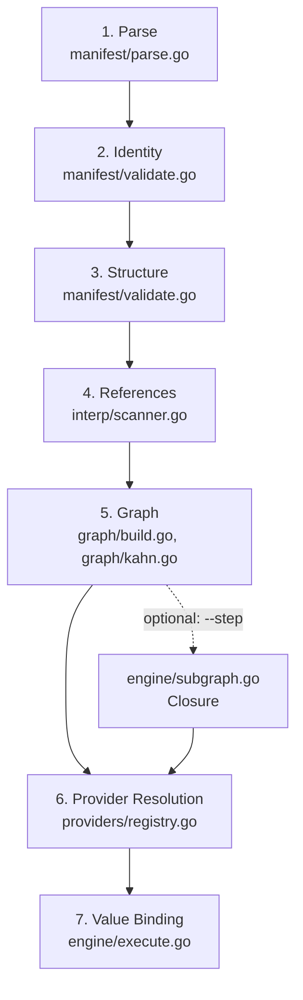

# Shipwright Architecture: The Seven-Stage Workflow Pipeline

Shipwright runs a declarative `shipwright.dev/v1` workflow manifest
(`.shipwright/workflow.yaml` by default) through a fixed, seven-stage
validation pipeline before a single capability ever touches a container.
Each stage lives in its own package, rejects a distinct class of error, and
hands a narrower, more-validated artifact to the next: raw bytes become a
typed manifest, the manifest becomes a compiled dependency graph, and the
graph becomes an executed workflow. This document walks that pipeline
top-to-bottom the same way `main.go` drives it, so a new contributor can
trace `.shipwright/workflow.yaml` all the way to a running step without
reading any other doc first.

## The Flow

Stages 1-3 run inside `manifest.ParseFile` and return once, at
`main.go:275`. Stage 5 runs inside `graph.Build` and returns once, at
`main.go:280` — and stage 5 is also where stage 4's static reference
checking actually executes (`graph.Build` calls `interp.Scan` internally;
see Stage 5 below). Stages 6-7 do not run once: they run per step, once per
wave, inside `engine.Execute` (`main.go:506`), because a provider cannot be
resolved and a `with` value cannot be bound until the step that produces an
upstream `steps.<id>.output` has actually finished running.

## CLI Entrypoint (current)

`main.go`'s `--workflow <path>` flag (default `.shipwright/workflow.yaml`) is
the sole CLI entrypoint. It parses a `shipwright.dev/v1` manifest, builds its
DAG, resolves each step's provider, and executes it through
`internal/workflow/engine`.

| Flag | Status |
|---|---|
| `--workflow <path>` | Current — primary entrypoint |
| `--step <id>` | Current — retargeted to a manifest step id; runs its `needs`-transitive closure |
| `--list-steps` | Current — retargeted to list manifest step ids with capability and resolved provider |
| `--pipeline`, `--list-pipelines` | **Removed** — named presets no longer exist |
| `--only-build`, `--only-test`, `--skip-push` | **Removed** — `--step` replaces them |
| `--config`, `--env`, `--executor`, `--verbose`, `--version`, `--health`, `--local`, git flags | Unchanged |

## Stage 1: Parse

`manifest.ParseFile` (`internal/workflow/manifest/parse.go`) opens the
manifest file and hands it to `Parse`, which reads at most
`MaxManifestBytes + 1` bytes through `io.LimitReader` before ever invoking
the YAML decoder. Only a byte slice already proven to be within
`MaxManifestBytes` (1 MiB) reaches `yaml.NewDecoder`, and that decoder runs
with `KnownFields(true)` — an unrecognized field in the document is a decode
error, not a silently-ignored one.

**Fails when**: the file exceeds `manifest.MaxManifestBytes` (`readCapped`
returns an error — the defense against alias-amplification / "billion
laughs" documents), or the YAML fails to decode into the typed `Manifest`
struct, including any field `KnownFields(true)` does not recognize.

## Stage 2: Identity

`ValidateIdentity` (`internal/workflow/manifest/validate.go`) checks the
document's own version and type before inspecting anything about its
steps: `apiVersion` must be present and in the allowlist (today, exactly
`shipwright.dev/v1`), `kind` must equal `Workflow`, and `metadata.name`
must be present.

**Fails when**: `apiVersion` is missing or unsupported, `kind` is missing
or not `Workflow`, or `metadata.name` is empty.

## Stage 3: Structure

`ValidateStructure` (`internal/workflow/manifest/validate.go`) walks
`spec.steps` and checks each step's shape in isolation — not yet its
relationships to other steps, which is stage 5's job. A step's `id` must be
non-empty and unique among all steps seen so far, `capability` must be one
of the five known contract types (`build`, `test`, `artifact`, `deploy`,
`run`), `uses` must name a `provider` or a `module`, and `uses.version`
must be non-empty. `spec.execution.concurrency.maxParallel` is also
checked here: it must be `>= 0`.

**Fails when**: an empty or duplicate step id, an unsupported `capability`
value, a step with neither `uses.provider` nor `uses.module`, an empty
`uses.version`, or a negative `maxParallel`.

## Stage 4: References

Every string field a step can populate with a placeholder —
`input`, a `with` entry, and so on — can contain
`${{ variables.<name> }}`, `${{ secrets.<name> }}`, or
`${{ steps.<id>.output }}`. `interp.Scan`
(`internal/workflow/interp/scanner.go`) parses those placeholders against
a small, closed, hand-written grammar — never a general template engine,
never `os.Expand`, and never an expression evaluator — so a placeholder
either matches one of exactly three shapes or it is a parse error. This
stage is static: it only recognizes references, it does not resolve them
to a value yet. `Scan` is not called from `main.go` directly; it is called
from inside stage 5's `graph.Build` (see below) and again, at execution
time, from stage 7.

**Fails when**: an unclosed or nested `${{ }}` delimiter, a stray closing
delimiter with no matching opener, or a placeholder body that does not
match `variables.<name>`, `secrets.<name>`, or `steps.<id>.output`.

## Stage 5: Graph

`graph.Build` (`internal/workflow/graph/build.go`, called from
`main.go:280`) is where stage 4's scanner is actually put to work, and
where the workflow's dependency graph is compiled and validated end to
end. In order: it builds the node set and rejects a duplicate step id or a
`needs[]` entry naming an unknown step; it calls `interp.Scan` on every
step's `input` and `with` fields and rejects a `steps.<id>.output`
reference to a step not also present in that step's own `needs[]` (an
undeclared data dependency); it rejects the one kind mismatch decidable
without a resolved provider (a `secrets.*` reference used where a
Directory-typed `input` is expected); and finally it runs Kahn's algorithm
(`internal/workflow/graph/kahn.go`) to detect cycles and produce the
topologically-ordered `Waves` the engine executes.

When `--step <id>` is passed, `main.go` calls `engine.Closure`
(`internal/workflow/engine/subgraph.go`) against this already-built graph
to compute `<id>`'s needs-transitive closure — a subgraph, not a
re-validation. `Closure` never re-runs cycle detection (a subset of an
acyclic graph's edges cannot introduce a cycle), and its own
`UnknownStepError` fires only when `--step` names an id absent from the
compiled graph.

**Fails when**: `graph.DuplicateStepIDError`, `graph.UnknownNeedsError`,
`graph.UndeclaredDataReferenceError`, `graph.KindMismatchError`, or
`graph.CycleError` (Kahn drains every zero-in-degree node and steps
remain — those steps are in, or downstream of, a cycle).

## Stage 6: Provider Resolution

Once the graph is compiled, `main.go` builds a `providers.Registry`
(`internal/workflow/providers/registry.go`) via `providers.NewRegistry`
and `providers.RegisterDefaults`. Each step's `uses.provider` (or
`uses.module`) and `uses.version` resolve against this registry through a
capability-specific `Resolve*` method (`ResolveBuilder`, `ResolveTester`,
`ResolveArtifactor`, `ResolveDeployer`, `ResolveRunner`). Resolution is
closed by design: a provider resolves only to an already-compiled,
self-registered implementation — there is no fetch, download, cache, or
dynamic `.so` load anywhere in this package, which is what keeps a
manifest from ever running arbitrary native code in-process. A resolved
provider also declares a `WithSchema` (its accepted `with` field names and
expected kinds), checked against the step's interpolated values at
resolution time.

**Fails when**: `providers.UnregisteredProviderError` (no provider
registered for that `Name`/`Module`), `providers.UnsupportedVersionError`
(the provider exists, but not at the requested version), or
`providers.WithSchemaMismatchError` (a `with` field's resolved kind does
not match the provider's declared schema for that field).

## Stage 7: Value Binding

`engine.Execute` (`internal/workflow/engine/execute.go:325`, called from
`main.go:506`) is the first place in the pipeline where the compiled
graph, the resolved registry, and interpolated values are all in scope
together — because a `steps.<id>.output` reference cannot be resolved
until the step that produces it has actually run. `Execute` walks
`Graph.Waves` in order; within a wave, steps run sequentially in
manifest-declaration order, never concurrently. For each step,
`resolveInput` and `resolveWith` scan and render its `input`/`with`
fields, calling `interp.Render` (`internal/workflow/interp/render.go:25`)
to turn each reference into a typed `interp.Value` — and `Render` itself
refuses to concatenate a secret with literal text or another reference,
so a secret can only ever be a field's entire value. The bound values are
then dispatched to the resolved capability method.

Two engine-level controls apply per step here: **fail-fast**
(`Options.FailFast`) stops scheduling further waves as soon as one step
fails, and **retry** (`Options.Retries`, overridable per step via the
manifest's `attempts` field) re-attempts a failing step up to its
configured budget before recording it as failed.

**Fails when**: `engine.StepFailedError` (every configured attempt for a
step failed — wraps that step's last error and names the first failing
step id), `engine.OutputKindMismatchError` (a `steps.<id>.output`
reference resolves to a value whose kind cannot satisfy the field it is
used in — for example, a `with` field expecting a string receiving a
step that produced a directory), `engine.StepTimeoutError` (a step
exceeded its configured `Options.Timeout`), or one of
`engine.UndeclaredVariableError` / `engine.UndeclaredSecretError` /
`engine.MissingStepOutputError` (a reference to a name or step id that
was never declared, or whose output is not yet available).

## Stage-to-Source Summary

| Stage | Package | Entry point |
|---|---|---|
| 1. Parse | `internal/workflow/manifest` | `parse.go` — `ParseFile`, `Parse` |
| 2. Identity | `internal/workflow/manifest` | `validate.go` — `ValidateIdentity` |
| 3. Structure | `internal/workflow/manifest` | `validate.go` — `ValidateStructure` |
| 4. References | `internal/workflow/interp` | `scanner.go` — `Scan` |
| 5. Graph | `internal/workflow/graph` | `build.go` — `Build`; `kahn.go` — cycle detection |
| 6. Provider Resolution | `internal/workflow/providers` | `registry.go` — `Resolve*` |
| 7. Value Binding | `internal/workflow/engine` | `execute.go` — `Execute`, `Render` calls |

## Next

This document covers only what the engine and graph enforce, and where —
it deliberately excludes how a workflow author fixes a rejected manifest.
For manifest-authoring guidance, remediation examples, and corrected-YAML
patterns, see the workflow authoring guide (tracked separately). For the
guaranteed CLI/API compatibility surface, see `COMPATIBILITY.md` at the
repository root.
