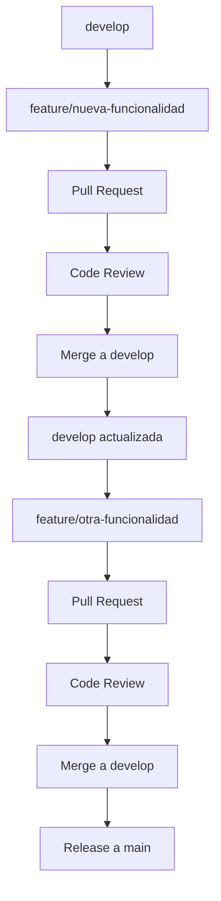

# Estrategia de Branching - Syntegrity Dagger

## 🎯 Objetivo
Prevenir conflictos de merge mediante una estrategia clara de branching y coordinación entre desarrolladores.

## 🌳 Estructura de Ramas

### Ramas Principales
- **`main`**: Rama de producción, solo releases estables
- **`develop`**: Rama de integración, donde se fusionan features

### Ramas de Trabajo
- **`feature/nombre-descripcion`**: Para nuevas funcionalidades
- **`fix/nombre-descripcion`**: Para correcciones de bugs
- **`hotfix/nombre-descripcion`**: Para correcciones urgentes en producción
- **`chore/nombre-descripcion`**: Para tareas de mantenimiento

## 📝 Reglas de Branching

### ✅ Reglas Obligatorias

1. **Nunca trabajar directamente en `main` o `develop`**
   ```bash
   # ❌ MALO
   git checkout main
   git commit -m "fix: something"
   
   # ✅ BUENO
   git checkout -b fix/resolve-issue-123
   git commit -m "fix: resolve issue 123"
   ```

2. **Siempre crear ramas desde `develop`**
   ```bash
   git checkout develop
   git pull origin develop
   git checkout -b feature/new-pipeline-logic
   ```

3. **Mantener ramas pequeñas y enfocadas**
   - Una rama = una funcionalidad/corrección
   - Máximo 3-5 commits por rama
   - Si necesitas más commits, considera dividir en múltiples ramas

4. **Sincronizar frecuentemente con `develop`**
   ```bash
   # Al menos una vez al día
   git checkout develop
   git pull origin develop
   git checkout tu-rama
   git rebase develop
   ```

### 🔄 Flujo de Trabajo



## 🚫 Reglas para Evitar Conflictos

### 1. **Coordinación en Archivos Críticos**
- **`.github/workflows/*.yml`**: Solo una persona por archivo a la vez
- **`go.mod`**: Coordinar cambios de dependencias
- **`main.go`**: Cambios estructurales requieren coordinación

### 2. **Comunicación Obligatoria**
- Antes de tocar workflows: anunciar en el canal del equipo
- Cambios en dependencias: crear issue para coordinación
- Refactoring mayor: crear RFC (Request for Comments)

### 3. **Tamaño de Cambios**
- **Workflows**: Máximo 50 líneas por PR
- **Dependencias**: Un cambio de dependencia por PR
- **Refactoring**: Dividir en PRs pequeños y secuenciales

## 🔧 Herramientas de Prevención

### 1. **Pre-commit Hooks**
```bash
# Instalar pre-commit
pip install pre-commit

# Configurar hooks
pre-commit install
```

### 2. **Git Aliases Útiles**
```bash
# Agregar a ~/.gitconfig
[alias]
    sync = "!git checkout develop && git pull origin develop && git checkout - && git rebase develop"
    cleanup = "!git branch --merged | grep -v '\\*\\|main\\|develop' | xargs -n 1 git branch -d"
    conflicts = "!git diff --name-only --diff-filter=U"
```

### 3. **Scripts de Automatización**
```bash
# Script para sincronizar rama
#!/bin/bash
# sync-branch.sh
current_branch=$(git branch --show-current)
git checkout develop
git pull origin develop
git checkout $current_branch
git rebase develop
echo "✅ Rama $current_branch sincronizada con develop"
```

## 📊 Métricas de Éxito

- **Conflictos por semana**: < 2
- **Tiempo de resolución**: < 30 minutos
- **Ramas activas**: < 5 por desarrollador
- **Tamaño promedio de PR**: < 200 líneas

## 🆘 Resolución de Conflictos

### Cuando Ocurren Conflictos

1. **No entrar en pánico** - Es normal en desarrollo colaborativo
2. **Comunicar inmediatamente** - Avisar al equipo
3. **Priorizar por impacto** - Resolver los más críticos primero
4. **Documentar la resolución** - Para aprender y prevenir

### Proceso de Resolución

```bash
# 1. Identificar conflictos
git status

# 2. Resolver manualmente
# Editar archivos con conflictos

# 3. Marcar como resueltos
git add archivo-resuelto.yml

# 4. Completar merge
git commit -m "resolve: merge conflicts in workflow"

# 5. Verificar que todo funciona
git log --oneline -3
```

## 🎓 Mejores Prácticas

### Para Desarrolladores
- **Pull frecuente**: `git pull origin develop` al menos 2 veces al día
- **Commits atómicos**: Un commit = un cambio lógico
- **Mensajes descriptivos**: Usar conventional commits
- **Testing local**: Verificar que todo funciona antes de push

### Para Code Reviewers
- **Revisar rápidamente**: Máximo 24 horas para revisar
- **Feedback constructivo**: Explicar el "por qué" no solo el "qué"
- **Aprobar solo si está listo**: No aprobar por presión

### Para el Equipo
- **Daily standups**: Mencionar en qué archivos estás trabajando
- **Comunicación proactiva**: Avisar antes de tocar archivos críticos
- **Retrospectivas**: Revisar conflictos en retrospectivas para mejorar

## 📚 Recursos Adicionales

- [Git Flow](https://nvie.com/posts/a-successful-git-branching-model/)
- [Conventional Commits](https://www.conventionalcommits.org/)
- [GitHub Flow](https://docs.github.com/en/get-started/quickstart/github-flow)
