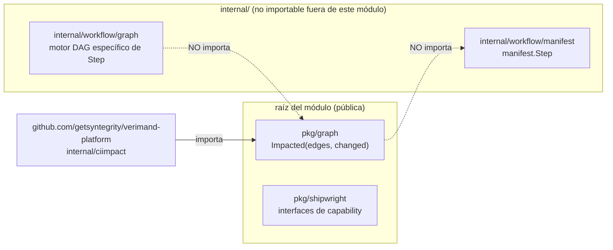
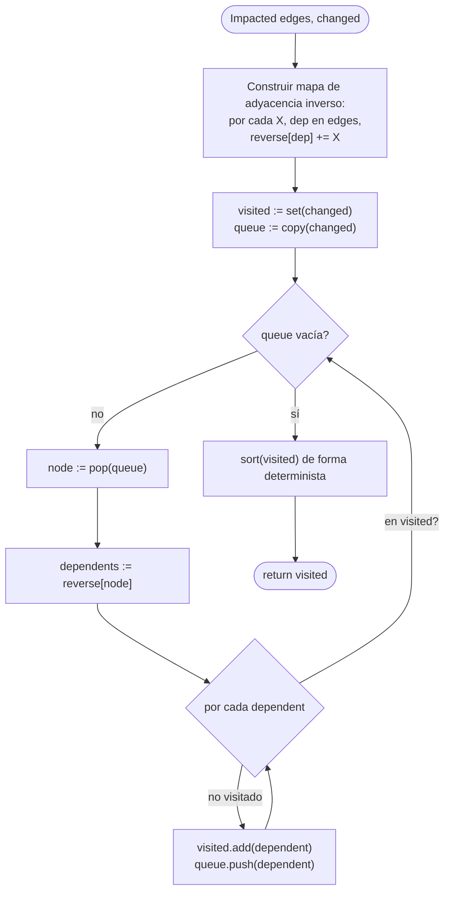

# Diseño: `pkg/graph.Impacted`

Fuente de verdad para alcance y justificación: `proposal.md`. Fuente de
verdad para el contrato verificable: `specs/impact-graph/spec.md`. Este
documento cubre solo arquitectura, algoritmo y estructuras de datos.

## 1. Estructura del paquete

```
pkg/graph/
├── impacted.go       # Impacted(edges, changed) []string
└── impacted_test.go
```

Sin subpaquetes, sin tipos exportados más allá de la única función.
`pkg/graph` se ubica junto a `pkg/shipwright` en la raíz pública del módulo —
ambos son destinos de import para consumidores externos, ninguno depende de
`internal/`.



Las aristas punteadas son el punto central: `pkg/graph` e
`internal/workflow/graph` son dos implementaciones independientes de
"recorrer un grafo", no una abstracción compartida — ver D1 en
`proposal.md` para la justificación de por qué se rechazó fusionarlas.

## 2. Algoritmo

Alcance inverso desde un conjunto semilla, calculado invirtiendo el mapa de
aristas una única vez y luego ejecutando un BFS protegido por conjunto
visitado desde cada nodo en `changed`.



**Por qué invertir-y-luego-BFS, no DFS con memo:** ambos son O(V+E) y
equivalentes en corrección; se eligió BFS solo porque la guarda de conjunto
visitado se lee de forma más obvia como "seguro ante ciclos por
construcción" en la revisión — sin diferencia funcional, no es una decisión
determinante.

**Por qué invertir una vez al inicio, en lugar de recorrer `edges` hacia
adelante por cada consulta:** `edges[X]` se expresa en dirección de
dependencia (D2, `proposal.md`), pero el recorrido necesita la dirección de
dependiente. Invertir una vez cuesta O(E) y convierte cada búsqueda
posterior en una simple lectura de mapa; recorrer `edges` hacia adelante por
cada nodo significaría escanear el mapa completo por cada nodo visitado —
O(V·E) en el peor caso. Para los tamaños de grafo que esta función
contempla (el grafo de módulos propio de un repo, no un índice global de
paquetes) esto es una elección de factor constante menor, no un requisito de
escalabilidad — se registra porque un revisor de otro modo preguntará "por
qué invertir primero".

**La seguridad ante ciclos es estructural, no de detección-y-rechazo:** el
conjunto visitado se verifica antes de que un nodo pueda agregarse a la cola
por segunda vez, así que un ciclo simplemente deja de aportar trabajo nuevo
— no hay un paso separado de detección de ciclos, ni un camino de error para
"el grafo tiene un ciclo" (`Impacted` no tiene retorno de error en
absoluto; la entrada malformada degrada de forma controlada según los
requisitos de Tolerancia a Entradas Malformadas y Seguridad ante Ciclos del
spec, nunca falla la llamada).

**Aristas colgantes:** `reverse[dep]` para un `dep` ausente de las propias
claves de `edges` simplemente nunca se puebla como fuente — el mapa inverso
se construye iterando las claves de `edges`, así que un nodo que solo
aparece como *valor* (nunca como clave) naturalmente no tiene entradas
salientes que recorrer más adelante. No se necesita ninguna verificación
especial.

**Determinismo:** el orden de iteración de maps en Go es aleatorio, así que
el conjunto `visited` (probablemente un `map[string]struct{}` para
membresía O(1)) se convierte a slice y se ordena (`sort.Strings`) exactamente
una vez, al final, antes de retornar — nunca se depende de él a mitad de
algoritmo.

## 3. Estructuras de datos

| Nombre | Tipo | Propósito |
|---|---|---|
| `edges` (entrada) | `map[string][]string` | Dirección de dependencia: `edges[X]` = de qué depende `X` |
| `reverse` (interno) | `map[string][]string` | Dirección de dependiente: `reverse[X]` = qué depende de `X`; construido una vez a partir de `edges` |
| `visited` (interno) | `map[string]struct{}` | Conjunto de membresía, funciona a la vez como acumulador de nodos impactados |
| `queue` (interno) | `[]string` (slice usado como FIFO) | Frontera del BFS |
| valor de retorno | `[]string` | Claves de `visited`, ordenadas, deduplicadas por construcción (semántica de map) |

Sin tipos exportados. La firma de la función (`spec.md`, requisito
"Convención de dirección de dependencia") es la totalidad de la superficie
pública:

```go
func Impacted(edges map[string][]string, changed []string) []string
```

## 4. Plan de tests

Cada escenario en `specs/impact-graph/spec.md` se corresponde con un caso de
test en `impacted_test.go` (table-driven) — RED primero, según
`strict_tdd: true` (`openspec/config.yaml`):

| Requisito de spec.md | Caso(s) de test |
|---|---|
| Convención de dirección de dependencia | `direct dependent via edges[X]=deps` |
| Auto-inclusión del conjunto modificado | `changed leaf con no dependents`, `changed node desconocido para edges` |
| Alcance inverso transitivo | `direct`, `multi-level transitive`, `fan-out`, `fan-in`, `disconnected node excluded` |
| Tolerancia a entradas malformadas | `dangling edge no genera panic` |
| Seguridad ante ciclos | `self-edge`, `ciclo mutuo de dos nodos`, `ciclo de tres nodos` |
| Colapso de aristas duplicadas | `arista duplicada, salida única` |
| Salida determinista y ordenada | `llamadas repetidas salida idéntica`, `grafo vacío y changed vacío` |
| Sin acoplamiento a ejecución ni a manifiesto | verificación estática — `go list -deps ./pkg/graph/...` (o inspección de imports equivalente) confirma que no hay import de `internal/`; no es un caso de `_test.go` |

## 5. Riesgos (a nivel de implementación, complementa `proposal.md`)

| Riesgo | Mitigación |
|---|---|
| La construcción del mapa `reverse` pierde silenciosamente una dependencia si `edges[X]` contiene un duplicado | El test de Colapso de Aristas Duplicadas verifica la corrección de la salida sin importar esto; que `reverse[dep]` crezca con una entrada extra (inofensiva) por duplicado no afecta el resultado del conjunto visitado |
| Slice nil vs. vacío en el valor de retorno rompe un `reflect.DeepEqual`/`assert.Equal` del llamador contra `[]string{}` | El valor de retorno siempre es un slice creado con `make`, no nil, incluso cuando `visited` está vacío — verificado por el caso de test "grafo vacío y changed vacío" |
