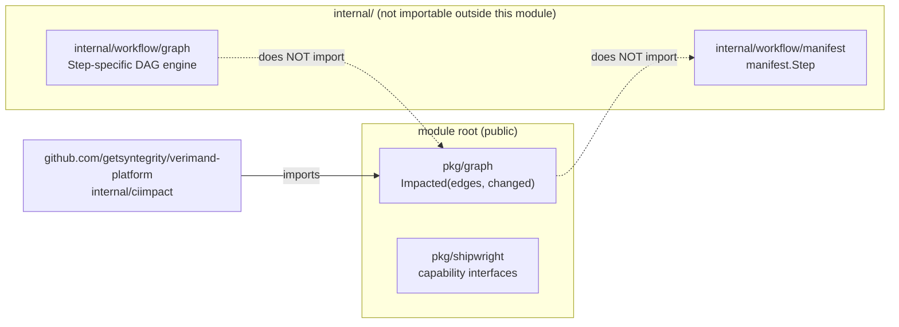
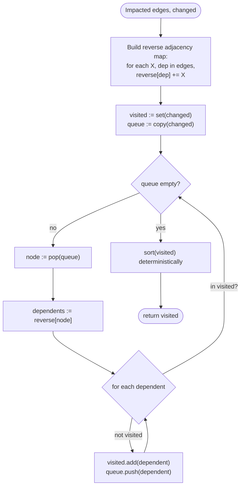

# Design: `pkg/graph.Impacted`

Source of truth for scope and rationale: `proposal.md`. Source of truth for
the testable contract: `specs/impact-graph/spec.md`. This document covers
architecture, algorithm, and data structures only.

## 1. Package Layout

```
pkg/graph/
├── impacted.go       # Impacted(edges, changed) []string
└── impacted_test.go
```

No sub-packages, no exported types beyond the one function. `pkg/graph` sits
beside `pkg/shipwright` at the module's public root — both are import
targets for external consumers, neither depends on `internal/`.



The dotted edges are the point: `pkg/graph` and `internal/workflow/graph`
are two independent implementations of "traverse a graph," not a shared
abstraction — see D1 in `proposal.md` for why merging them was rejected.

## 2. Algorithm

Reverse reachability from a seed set, computed by inverting the edge map
once and then running a visited-set-guarded BFS from every node in
`changed`.



**Why reverse-then-BFS, not DFS-with-memo:** both are O(V+E) and equally
correct; BFS was picked only because the visited-set guard reads more
obviously as "cycle-safe by construction" in review — no functional
difference, not a load-bearing decision.

**Why invert once up front, not walk `edges` forward per query:** `edges[X]`
is expressed in dependency direction (D2, `proposal.md`), but the traversal
needs dependent direction. Inverting once costs O(E) and turns every
subsequent lookup into a plain map read; walking `edges` forward per node
would mean scanning the entire map for each visited node — O(V·E) in the
worst case. For the graph sizes this function targets (a repo's own module
graph, not a global package index) this is a minor constant-factor choice,
not a scalability requirement — recorded because a reviewer will otherwise
ask "why invert first."

**Cycle safety is structural, not detected-and-rejected:** the visited set
is checked before a node is ever added to the queue a second time, so a
cycle simply stops contributing new work — there is no separate
cycle-detection pass, and no error path for "graph has a cycle" (`Impacted`
has no error return at all; malformed input degrades gracefully per the
spec's Malformed-Input Tolerance and Cycle Safety requirements, it never
fails the call).

**Dangling edges:** `reverse[dep]` for a `dep` absent from `edges`' own keys
is simply never populated as a source — the reverse map is built by
iterating `edges`' keys, so a node that only ever appears as a *value*
(never a key) naturally has no outgoing entries to traverse further. No
special-case check is needed.

**Determinism:** map iteration order in Go is randomized, so the `visited`
set (itself likely a `map[string]struct{}` for O(1) membership) is converted
to a slice and sorted (`sort.Strings`) exactly once, at the end, before
returning — never relied upon mid-algorithm.

## 3. Data Structures

| Name | Type | Purpose |
|---|---|---|
| `edges` (input) | `map[string][]string` | Dependency direction: `edges[X]` = what `X` depends on |
| `reverse` (internal) | `map[string][]string` | Dependent direction: `reverse[X]` = what depends on `X`; built once from `edges` |
| `visited` (internal) | `map[string]struct{}` | Membership set, doubles as the impacted-node accumulator |
| `queue` (internal) | `[]string` (slice used as FIFO) | BFS frontier |
| return value | `[]string` | `visited`'s keys, sorted, deduplicated by construction (map semantics) |

No exported types. The function signature (`spec.md`, Requirement
"Dependency-Direction Convention") is the entire public surface:

```go
func Impacted(edges map[string][]string, changed []string) []string
```

## 4. Test Plan

Every scenario in `specs/impact-graph/spec.md` maps to one table-driven test
case in `impacted_test.go` — RED first, per `strict_tdd: true`
(`openspec/config.yaml`):

| spec.md Requirement | Test case(s) |
|---|---|
| Dependency-Direction Convention | `direct dependent via edges[X]=deps` |
| Changed Set Self-Inclusion | `changed leaf with no dependents`, `changed node unknown to edges` |
| Transitive Reverse Reachability | `direct`, `multi-level transitive`, `fan-out`, `fan-in`, `disconnected node excluded` |
| Malformed-Input Tolerance | `dangling edge does not panic` |
| Cycle Safety | `self-edge`, `mutual two-node cycle`, `three-node cycle` |
| Duplicate Edge Collapse | `duplicate edge, single output` |
| Deterministic, Sorted Output | `repeated calls identical output`, `empty graph and empty changed` |
| No Execution or Manifest Coupling | static check — `go list -deps ./pkg/graph/...` (or equivalent import inspection) asserts no `internal/` import; not a `_test.go` case |

## 5. Risks (implementation-level, complementing `proposal.md`)

| Risk | Mitigation |
|---|---|
| `reverse` map construction silently drops a dependency if `edges[X]` contains a duplicate | Duplicate Edge Collapse test asserts output correctness regardless; `reverse[dep]` growing by one extra (harmless) entry per duplicate does not affect the visited-set outcome |
| Nil vs. empty slice on the return value breaks a caller's `reflect.DeepEqual`/`assert.Equal` against `[]string{}` | Return value is always a make'd, non-nil slice, even when `visited` is empty — asserted by the "empty graph and empty changed" test case |
